# 🌟 Favorite Manager — Documentação Técnica & Manual Completo do Projeto

> **Manual Definitivo: Contexto Real, O Que É, Por Que Usar, Taxonomia Completa, Como Usar, Arquitetura, Algoritmos, Como Foi Construído e Solução de Problemas.**

---

## 📑 Sumário

1. [O Que É o Favorite Manager?](#-1-o-que-é-o-favorite-manager)
2. [A Origem: O Desafio Real dos 3.511 Favoritos](#-2-a-origem-o-desafio-real-dos-3511-favoritos)
3. [Por Que Usar? Diferenciais Frente ao Navegador Padrão](#-3-por-que-usar-diferenciais-frente-ao-navegador-padrão)
4. [A Taxonomia Semântica Completa (18 Categorias & Subpastas)](#-4-a-taxonomia-semântica-completa-18-categorias--subpastas)
5. [Guia Passo a Passo: Como Usar Cada Recurso](#-5-guia-passo-a-passo-como-usar-cada-recurso)
   - 5.1. [Instalação no Microsoft Edge](#51-instalação-no-microsoft-edge)
   - 5.2. [Organização Inteligente com IA e Motor Semântico](#52-organização-inteligente-com-ia-e-motor-semântico)
   - 5.3. [Busca Instantânea na Barra de Endereços (Omnibox `fav`)](#53-busca-instantânea-na-barra-de-endereços-omnibox-fav)
   - 5.4. [Paleta de Comandos Rápida (`Ctrl + K` / `Ctrl + Shift + F`)](#54-paleta-de-comandos-rápida-ctrl--k--ctrl--shift--f)
   - 5.5. [Central de Limpeza e Manutenção (4 Ferramentas)](#55-central-de-limpeza-e-manutenção-4-ferramentas)
   - 5.6. [Auto-Organização em Tempo Real (`Ctrl + D`)](#56-auto-organização-em-tempo-real-ctrl--d)
   - 5.7. [Exportação em Markdown Awesome List (`README.md`)](#57-exportação-em-markdown-awesome-list-readmemd)
   - 5.8. [Snapshots de Segurança e Recuperação de Acidentes](#58-snapshots-de-segurança-e-recuperação-de-acidentes)
   - 5.9. [Uso no Edge Side Panel (Painel Lateral)](#59-uso-no-edge-side-panel-painel-lateral)
6. [Como Funciona: Arquitetura, Engenharia e Algoritmos](#-6-como-funciona-arquitetura-engenharia-e-algoritmos)
   - 6.1. [Por que o sistema é ultrarrápido (99ms)?](#61-por-que-o-sistema-é-ultrarrápido-99ms)
   - 6.2. [Movimentação Paralela em Lotes de 25 Operações](#62-movimentação-paralela-em-lotes-de-25-operações)
   - 6.3. [Algoritmo de Pruning Pós-Ordem (Bottom-Up) de Pastas Vazias](#63-algoritmo-de-pruning-pós-ordem-bottom-up-de-pastas-vazias)
   - 6.4. [Sanitização e Higienização de Rastreadores (Regex Engine)](#64-sanitização-e-higienização-de-rastreadores-regex-engine)
   - 6.5. [Scanner Concorrente de Integridade HTTP & Wayback Machine](#65-scanner-concorrente-de-integridade-http--wayback-machine)
   - 6.6. [Service Worker Manifest V3 e Bypass Seguro de CORS](#66-service-worker-manifest-v3-e-bypass-seguro-de-cors)
7. [Como Foi Construído: Stack Tecnológico e Estrutura de Código](#-7-como-foi-construído-stack-tecnológico-e-estrutura-de-código)
8. [Perguntas Frequentes & Solução de Problemas (FAQ)](#-8-perguntas-frequentes--solução-de-problemas-faq)

---

## 📌 1. O Que É o Favorite Manager?

O **Favorite Manager** é uma extensão profissional de alto desempenho construída especificamente para o **Microsoft Edge** (e compatível com qualquer navegador Chromium, como Chrome, Brave e Opera) sob as diretrizes do **Manifest V3**.

O objetivo da extensão é transformar a gestão caótica de favoritos do navegador em um **ambiente de trabalho organizado, auditado e inteligente**, integrando manipulação direta através da API nativa `chrome.bookmarks`, processamento semântico local ultrarrápido, proteção com snapshots atômicos e ferramentas de manutenção profunda de URLs.

A aplicação se divide em três superfícies complementares:
1. **Painel Completo Desktop (`index.html`)**: Gerenciador em tela cheia com visualização em lista detalhada ou grade de cartões, árvore navegável, estatísticas em tempo real, inspetor lateral de metadados e central de limpeza.
2. **Barra Lateral do Edge (`Side Panel - sidepanel.html`)**: Visualização compacta e responsiva que se acopla à barra lateral direita do Edge para consulta rápida sem sair da página onde você está trabalhando.
3. **Menu Pop-up de Ação Rápida (`popup.html`)**: Mini-janela acionada pelo ícone da barra de ferramentas com atalhos para abrir a aplicação completa, a barra lateral ou efetuar buscas instantâneas.

---

## 🔍 2. A Origem: O Desafio Real dos 3.511 Favoritos

A maioria das extensões de favoritos do mercado foi feita para coleções pequenas (50 a 100 links). Quando submetidas a uma biblioteca real de um profissional técnico — com milhares de itens acumulados durante anos —, elas congelam, estouram a memória do navegador ou simplesmente falham ao tentar mover as pastas.

O **Favorite Manager** foi concebido a partir da análise exaustiva de um arquivo real de exportação (`favoritos_22_09_2026. html.html`), que continha:
- **3.511 favoritos cadastrados**;
- **86 pastas originais** com sobreposições conceituais severas;
- **1.116 links acumulados** em uma única pasta desordenada (`Barra de favoritos / OUTROS / DIVERSOS`);
- Dezenas de favoritos misturados entre jogos de PlayStation, Xbox e PC, filmes piratas misturados com partituras de orquestra, materiais de concursos acumulados com tutoriais de Scilab e esquemas elétricos de tratores e caminhões.

### Exigências Fundamentais do Projeto:
1. **Isolamento Absoluto**: **Jogos**, **Filmes & Séries** e **Música** não poderiam se misturar sob hipótese alguma.
2. **Unificação Técnica**: **Programação, Dev & IA** deveriam viver sob uma pasta mestre única e coesa.
3. **Especialização de Engenharia**: Subpastas inteligentes dedicadas para **Eletroeletrônica** (elétrica e eletrônica) e **Mecânica**.
4. **Performance Instantânea**: Organizar mais de 3.500 links em segundos, sem travamentos na API do navegador.
5. **Segurança de Pastas Vazias**: Ao mover os favoritos para novas estruturas, as pastas antigas desocupadas deveriam ser apagadas **apenas e exclusivamente se estivessem 100% vazias**, mantendo intactas as raízes nativas do Edge.

---

## 🎯 3. Por Que Usar? Diferenciais Frente ao Navegador Padrão

| Desafio no Edge Nativo | Solução no Favorite Manager |
|---|---|
| **Pastas vazias acumuladas** após reorganizar | **Algoritmo de Pruning Pós-Ordem** que remove apenas pastas 100% vazias |
| **Links mortos (Erro 404)** de sites antigos | **Scanner de Integridade** com botão direto para o **Wayback Machine (Archive.org)** |
| **URLs poluidas com espiões** (`utm_*`, `fbclid`, `si`) | **Higienizador de URLs** que remove rastreadores com 1 clique mantendo vídeos funcionais |
| **Títulos vagos** (*"Nova guia"*, *"Untitled"*, URL crua) | **Enriquecedor Automático** que lê a tag `<title>` real da página em background |
| **Dificuldade de localizar links** sem abrir menus | **Omnibox Edge (`fav termo`)** na barra de endereços e **Paleta `Ctrl + K`** |
| **Links novos desorganizados** ao salvar | **Auto-Organizador em Tempo Real (`Ctrl + D`)** com notificação nativa |
| **Medo de perder favoritos** ao fazer mudanças | **Snapshots Atômicos Locais** gravados antes de qualquer operação em massa |
| **Exportação rudimentar** em HTML obsoleto | **Exportador Awesome List Markdown (`README.md`)** pronto para GitHub/Notion |
| **Privacidade** comprometida por extensões comerciais | **Arquitetura 100% Local-First**: nenhum dado trafega na internet |

---

## 🧠 4. A Taxonomia Semântica Completa (18 Categorias & Subpastas)

O motor semântico categoriza a árvore em **18 categorias mestres** e dezenas de **subpastas inteligentes**:

```mermaid
graph TD
  Root["Favoritos do Microsoft Edge"]
  
  Root --> C1["📁 Programação, Dev & IA"]
  Root --> C2["📁 Jogos & Games"]
  Root --> C3["📁 Filmes, Séries & Animes"]
  Root --> C4["📁 Música"]
  Root --> C5["📁 Eletroeletrônica"]
  Root --> C6["📁 Mecânica & Engenharia"]
  Root --> C7["📁 Estudos & Educação"]
  Root --> C8["📁 Saúde, Fitness & Bem-Estar"]
  Root --> C9["📁 Negócios & Carreira"]
  Root --> C10["📁 Espiritualidade & Religião"]
  Root --> C11["📁 Governo & Cidadania"]
  Root --> C12["📁 Arte, Design & Personalização"]
  Root --> C13["📁 Lojas & Compras"]
  Root --> C14["📁 Produtividade & Ferramentas"]
  Root --> C15["📁 Turismo, Viagens & Eventos"]
  Root --> C16["📁 Redes Sociais & Comunicação"]
  Root --> C17["📁 Tecnologia & Informática"]
  Root --> C18["📁 Notícias & Atualidades"]
```



### Detalhamento das Subpastas:

#### 1. 📁 Programação, Dev & IA
- `Inteligência Artificial`: Claude, ChatGPT, OpenAI, Ollama, Hugging Face, DeepSeek, Gemini, Stable Diffusion, Suno, Kaggle, prompts e papers.
- `Repositórios & Código`: GitHub, GitLab, Bitbucket, Gists, SourceForge, commits e pull requests.
- `Documentações & Guias`: MDN Web Docs, Microsoft Learn, DevMedia, W3Schools, DevDocs, tutoriais de C, C++, C#, Python, JavaScript, TypeScript, Rust, Go.
- `Comunidade & Dúvidas`: Stack Overflow, Stack Exchange, fóruns técnicos de desenvolvimento.
- `Ferramentas & Dev Geral`: Docker, Kubernetes, APIs, SDKs, bancos de dados (PostgreSQL, SQLite), VS Code, Vercel, regex101.

#### 2. 📁 Jogos & Games (Completamente isolado de Filmes e Músicas)
- `Sony & PlayStation`: PS1, PS2, PS3, PS4, PS5, Gran Turismo 6, exclusivos, downloads de ISOs/PKGs e guias de PlayStation.
- `Nintendo`: Switch, Wii, Wii U, GameCube, Nintendo 64, 3DS, DS, Game Boy, Zelda, Pokémon, Mario, Metroid.
- `Xbox`: Xbox Clássico, Xbox 360, Xbox One, Series X/S, Xbox Game Pass, Halo, Forza.
- `PC & Lojas`: Steam, Epic Games, GOG, FitGirl Repacks, itch.io, Roblox, Minecraft, Path of Exile (PoE / PoE 2).
- `Mods & Comunidade`: Nexus Mods, MixMods, CurseForge, Modrinth, texturas, shaders, ENB, SKSE, MUGEN, skins.
- `Wikis, Guias & Databases`: PoE2DB, Maxroll, Mobalytics, Icy Veins, IGN, GameVício, detonados, tabelas e builds.
- `Emuladores & ROMs`: RetroArch, RPCS3, PCSX2, PPSSPP, DuckStation, BIOS, Vimm's Lair, RetroAchievements.

#### 3. 📁 Filmes, Séries & Animes
- `Streaming & Cinema`: Netflix, Prime Video, HBO Max, Disney+, YouTube Filmes, IMDb, Letterboxd, trailers.
- `Animes & Mangás`: Crunchyroll, AniList, MyAnimeList, mangás online, leitores de webtoons.
- `Torrents & Downloads`: Rastreadores, magnéticos de filmes e temporadas completas.
- `Legendas & Metadados`: OpenSubtitles, Legendas.tv, TheMovieDB, TV Time.

#### 4. 📁 Música
- `CCB & Hinários`: Hinários sacros CCB, ensaios musicais, reuniões da mocidade, administração musical, métodos de órgão e solfejo sacro.
- `Instrumentos & Luthiaria`: Violino, viola clássica, violoncelo, violão, arcos de crina, luthier, cavaletes, cordas Thomastik, breu.
- `Partituras & Cifras`: Cifra Club, partituras orquestrais em PDF, tablaturas, Songsterr, Ultimate Guitar, IMSLP.
- `Teoria & Solfejo`: Método Pozzoli, Bona, divisão rítmica, teoria harmônica, afinação 440Hz, claves e solfejo cantado.
- `Streaming & Clássica`: Concertos clássicos, filarmônicas, Bach, Beethoven, Mozart, Spotify, Deezer.

#### 5. 📁 Eletroeletrônica
- `Instalações Elétricas & Aterramento`: Aterramento elétrico, hastes, quadros de distribuição (QDF), disjuntores DIN, dimensionamento de bitolas de cabos (NBR 5410), energia solar fotovoltaica, inversores off-grid/grid-tie, diagramas unifilares.
- `Componentes & Datasheets`: AllDataSheet, Mouser, DigiKey, transistores (MOSFET, BJT), circuitos integrados, diodos, capacitores eletrolíticos, resistores, relés.
- `Circuitos & Esquemas`: KiCad, EasyEDA, Proteus, Fritzing, simulador Falstad Circuit Simulator, esquemáticos e confecção de PCI.
- `Microcontroladores & DIY`: Arduino (Uno, Mega, Nano), ESP32, ESP8266, Raspberry Pi, sensores, pontes H, módulos relé, robótica e automação residencial.

#### 6. 📁 Mecânica & Engenharia
- `Automotiva & Veículos`: Carros de passeio, motores a combustão, injeção eletrônica, fluidos e óleos lubrificantes, suspensão, freios ABS, calibragem de pneus, manuais de oficina de caminhões (Scania, Mercedes-Benz Axor, Iveco, Volvo) e tratores agrícolas.
- `Técnico Mecânico & Inspeção`: Manutenção preventiva e preditiva, alinhamento industrial, normas ABNT/DIN, procedimentos técnicos SENAI.
- `Usinagem & Ferramentas Pesadas`: Torno mecânico convencional e CNC, fresadoras, ferramentas de corte, retífica, escavadeiras hidráulicas, retroescavadeiras, pás carregadeiras, manuais técnicos de maquinário pesado.
- `CAD 3D & Modelagem`: SolidWorks, AutoCAD, Autodesk Fusion 360, GrabCAD, Thingiverse, modelagem paramétrica e perspectiva isométrica.

#### 7. 📁 Estudos & Educação
- `Cursos & Concursos`: Qconcursos, PortalEduca, SEST SENAT, simulados de vestibulares (ENEM, Fuvest), editais, apostilas preparatórias.
- `Biblioteca & Livros (PDF)`: Scribd, PDFCoffee, Archive.org Ebooks, Google Livros, BVirtual, Doceru, manuais técnicos em PDF.
- `Faculdades & Formação Técnica`: Portais de alunos (Uninter, Estácio, Fatecie, Senac), certificação por competência (IETAAM), plataformas EAD.
- `Idiomas & Gramática`: Aprendizado de inglês, gramática normativa da língua portuguesa, conjugadores de verbos, dicionários Michaelis/Dicio.
- `Ciências Exatas`: Matemática, física, cálculo diferencial e integral, softwares de cálculo numérico (Scilab, MATLAB, Wolfram Alpha).
- `Humanas & Filosofia`: História, sociologia, ensaios filosóficos e artigos acadêmicos.

#### 8. 📁 Saúde, Fitness & Bem-Estar
- `Medicina & Cuidados`: Consulta de sintomas, bulas de remédios (Tua Saúde, Consulta Remédios), planos de saúde (Hapvida), cuidados podológicos.
- `Farmácias & Manipulação`: Farmácias online, farmácias de manipulação de fórmulas, drogaria.
- `Suplementos & Nutrição`: Growth Suplementos (gsuplementos), Max Titanium, creatina, whey protein, vitaminas e tabelas nutricionais.
- `Treino & Ergonomia`: Fichas de academia, musculação, hipertrofia, postura e ergonomia no trabalho.

#### 9. 📁 Negócios & Carreira
- `Finanças & Investimentos`: Itaú, Mercado Pago, PayPal, plataformas de investimentos (Status Invest, Fundamentus, InfoMoney, B3, tesouro direto).
- `Empreendedorismo & Marcas`: SEBRAE, consulta e registro de marcas e patentes (INPI, Arena Marcas), abertura de MEI, Contabilizei.
- `Empregos & Oportunidades`: Portais de vagas, Vale Carreira, ABB Careers, LinkedIn Jobs, Escola do Trabalhador 4.0.

#### 10. 📁 Espiritualidade & Religião
- `Misticismo, Sonhos & Filosofia`: AMORC (Ordem Rosacruz), significado de sonhos, esoterismo, meditação e paz interior.
- `Astrologia, Cabala & Numerologia`: Astrolink, Personare, mapa astral, numerologia, calculadoras de gematria (GematriaLens).
- `Estudos Bíblicos`: Bíblias online, comentários bíblicos e dicionários teológicos.

#### 11. 📁 Governo & Cidadania
- `Serviços Públicos & Gov.br`: Portal Gov.br, Meu INSS, Receita Federal, Declaração de IRPF, Carteira Digital de Trânsito.
- `Detran & Trânsito`: Consultas de CNH, IPVA, licenciamento veicular e multas de trânsito.
- `Jurídico & Leis`: Jusbrasil, portal de legislação do Planalto, diários oficiais e consultas processuais.
- `Prefeitura & Concessionárias`: Emissão de IPTU, contas de energia elétrica (CEMIG/Enel), saneamento e água.

#### 12. 📁 Arte, Design & Personalização
- `Personalização, Ícones & Wallpapers`: Custom Cursor, Icon-Icons, GetWallpapers, Wallhaven, AlphaCoders, skins para Windows (Rainmeter, VisualSkins).
- `Design Gráfico & Ferramentas 3D`: Canva, editores vetoriais, bancos de modelos 3D gratuitos (Free3D), paletas de cores.

#### 13. 📁 Lojas & Compras
- `Tecnologia & Hardware`: KaBuM!, Pichau, TerabyteShop, suprimentos de informática e eletrônica.
- `Cupons, Ofertas & Comparadores`: Pelando, Promobit, Cuponomia, Zoom, Buscapé.
- `Marketplaces & Lojas Gerais`: Mercado Livre, Amazon Brasil, Shopee, AliExpress, Casas Bahia, Netshoes.
- `Perfumaria & Cuidados`: Lojas de cosméticos, perfumes importados e cuidados masculinos/femininos.

#### 14. 📁 Produtividade & Ferramentas
- `Utilitários & Nuvem`: Google Drive, Google Keep, OneDrive, Mega.nz, Dropbox, conversores de PDF (iLovePDF, SmallPDF), compactadores e geradores de dados.

#### 15. 📁 Turismo, Viagens & Eventos
- `Passagens, Hotéis & Pousadas`: Booking.com, Airbnb, Decolar, Skyscanner, Rentalcars, programas de milhas aéreas e ingressos de eventos (Eventim).

#### 16. 📁 Redes Sociais & Comunicação
- WhatsApp Web, Telegram Web, Discord, Instagram, Reddit, LinkedIn, Gmail, Outlook.

#### 17. 📁 Tecnologia & Informática
- Fóruns de hardware (Clube do Hardware, Adrenaline), Linux, segurança da informação, drivers e atualizações de sistema.

#### 18. 📁 Notícias & Atualidades
- Portais de notícias (G1, UOL, Folha, CNN Brasil, BBC) e estatísticas mundiais (Worldometer).

---

## 🚀 5. Guia Passo a Passo: Como Usar Cada Recurso

### 5.1. Instalação no Microsoft Edge
A extensão já está totalmente transpilada e empacotada na pasta `dist/`:

1. No Microsoft Edge, digite na barra de endereços:
   ```text
   edge://extensions/
   ```
2. No menu lateral esquerdo, certifique-se de que a opção **"Modo de desenvolvedor"** (*Developer mode*) está ativada.
3. Clique no botão **"Carregar sem compactação"** (*Load unpacked*) no topo da tela.
4. Navegue até a pasta descompactada e selecione o diretório **`dist`**.
5. A extensão **Favorite Manager** estará instalada e pronta para uso!

---

### 5.2. Organização Inteligente com IA e Motor Semântico
1. Abra o gerenciador em tela cheia clicando no ícone da extensão ou pelo atalho da barra.
2. Clique no botão roxo com ícone de brilhos: **`🤖 Organizar com IA`**.
3. Na janela que se abre:
   - O **⚡ Motor Semântico Ultrarrápido** já vem selecionado por padrão. Ele avalia 3.500 favoritos em menos de 0,2s.
   - Deixe marcada a opção:
     > ☑️ *Excluir automaticamente pastas que ficarem vazias após a movimentação*
4. Navegue pela árvore de prévia: você verá exatamente quais pastas serão criadas e quantos favoritos serão transferidos para cada subpasta temática.
5. Clique em **"Aplicar Organização com Subpastas"**.
6. Acompanhe a barra de progresso com porcentagem em tempo real. Em cerca de 4 segundos, toda a sua coleção estará dividida por temas e as pastas vazias serão removidas automaticamente.

---

### 5.3. Busca Instantânea na Barra de Endereços (Omnibox `fav`)
Você pode acessar qualquer favorito sem nem mesmo abrir a interface da extensão:
1. Abra uma nova guia no Edge.
2. Na barra de endereços (onde digita URLs), escreva:
   ```text
   fav
   ```
3. Pressione a tecla **Espaço** ou **Tab**. A barra mudará para o modo `Pesquisar favoritos:`.
4. Digite qualquer termo (ex: `fav ps3`, `fav scilab`, `fav github`, `fav ccb`).
5. O Edge exibirá os favoritos correspondentes direto no menu de sugestões. Pressione **Enter** para abrir a página imediatamente!

---

### 5.4. Paleta de Comandos Rápida (`Ctrl + K` / `Ctrl + Shift + F`)
Para navegar pelos seus 3.500 favoritos sem tirar as mãos do teclado:
1. Em qualquer tela do gerenciador, aperte **`Ctrl + K`** (ou `Ctrl + Shift + F`).
2. Uma janela flutuante estilo *Spotlight* surgirá no centro da tela.
3. Você pode:
   - Digitar o nome de qualquer site ou pasta para buscar instantaneamente.
   - Usar as setas do teclado (`↑` e `↓`) para selecionar e teclar **Enter** para abrir.
   - Digitar comandos rápidos: *"Organizar"*, *"Limpar Pastas Vazias"*, *"Links Quebrados"*, *"Exportar Markdown"*.

---

### 5.5. Central de Limpeza e Manutenção (4 Ferramentas)
No menu lateral, selecione **Central de Limpeza**. No topo da tela, você encontrará quatro abas especializadas:

#### Aba 1: Pastas Vazias
- Varre todas as pastas que ficaram sem favoritos e sem subpastas.
- Clique em **`[ 🗑️ Excluir Todas as Pastas Vazias ]`** para limpá-las todas de uma vez com 1 clique.

#### Aba 2: Rastreadores & UTM
- Detecta links contaminados por parâmetros de rastreamento de anúncios e redes sociais (`utm_source`, `fbclid`, `gclid`, `si`, `igshid`, etc.).
- Mostra a URL original com o trecho espião riscado em vermelho e a versão limpa em verde.
- Clique em **`[ 🧹 Limpar Todos os Rastreadores ]`** para higienizar todas as URLs da sua coleção em lote.

#### Aba 3: Títulos Genéricos
- Identifica links salvos com nomes como *"Nova guia"*, *"Home"*, *"Início"*, ou links cujo título é a própria URL.
- Clique em **`[ 🏷️ Buscar e Atualizar Títulos ]`**: o sistema acessa o site em segundo plano, lê o título real da página e atualiza seu favorito automaticamente.

#### Aba 4: Links Quebrados & 404 (Wayback Machine)
- Clique em **`[ Escanear Favoritos ]`**: testa as URLs em paralelo para saber quais páginas continuam no ar.
- Identifica erros de servidor, timeouts e páginas 404 (Não Encontradas).
- Para cada link caído, fornece o botão **`[ 🏛️ Wayback Machine ]`** para você recuperar com um clique a versão histórica gravada no Archive.org.
- O botão **`[ Excluir Links Quebrados ]`** permite apagar em massa todos os links mortos detectados.

---

### 5.6. Auto-Organização em Tempo Real (`Ctrl + D`)
- Sempre que você encontrar um site interessante e apertar **`Ctrl + D`** (ou clicar no ícone de estrela da barra do Edge), o **Favorite Manager** entra em ação.
- Ele analisa a URL e o título do novo favorito e o transfere na mesma hora para a subpasta temática correta.
- O Windows/Edge emite uma notificação nativa no canto da tela:
  > *⚡ Favorite Manager: Favorito salvo e organizado em: 📁 Jogos & Games / Sony & PlayStation*
- Para desativar ou reativar esse recurso, basta alternar o botão **"Auto-Organizar: ON/OFF"** no cabeçalho.

---

### 5.7. Exportação em Markdown Awesome List (`README.md`)
1. No menu lateral esquerdo, vá para **Snapshots & Backups**.
2. No card **"Awesome List (Markdown)"**, clique em **`[ Baixar README.md ]`**.
3. O navegador fará o download do arquivo `favoritos_awesome_list.md`, contendo:
   - Cabeçalho com data, horário e contadores de itens.
   - **Índice Geral navegável** (`## 📑 Índice Geral`) com links âncora para cada seção temática.
   - Estrutura completa de títulos e listas de links formatadas com Markdown padronizado.
   - Pronto para publicar no seu perfil do **GitHub**, importar como nota no **Obsidian** ou importar como banco de dados no **Notion**!

---

### 5.8. Snapshots de Segurança e Recuperação de Acidentes
- A extensão grava um ponto de restauração automático no armazenamento local antes de qualquer alteração estrutural.
- Na aba **Snapshots & Backups**, você pode visualizar o histórico de todos os snapshots criados com data e hora.
- Se você realizar uma exclusão por engano, pode criar um novo snapshot manual ou usar a exportação em **JSON** para backup externo.

---

### 5.9. Uso no Edge Side Panel (Painel Lateral)
- O Favorite Manager foi compilado com suporte nativo ao **Side Panel** do Edge.
- Ao abrir o painel lateral do Edge, você tem acesso à árvore completa de favoritos, busca e inspetor enquanto continua lendo páginas ou assistindo a vídeos no painel principal.
- No topo do painel lateral, há um botão com ícone de seta externa para expandir para tela cheia a qualquer momento.

---

## ⚙️ 6. Como Funciona: Arquitetura, Engenharia e Algoritmos

### 6.1. Por que o sistema é ultrarrápido (99ms)?
Modelos de linguagem como o Ollama são excelentes para texto livre, mas processar um prompt gigantesco com 3.500 URLs em um computador doméstico leva de 3 a 8 minutos e pode estourar o limite de contexto da GPU/RAM.

Para resolver isso, criamos o **Motor Semântico Heurístico (`classifier.ts`)**:
- Opera com **dicionários de domínios indexados em memória** com busca direta $O(1)$.
- Realiza **desempacotamento de parâmetros contextuais de URL** (extrai termos de buscas do Google AMP, slugs de caminho e parâmetros como `?q=`, `?search=`).
- Aplica árvores de decisão léxicas com expressões regulares compiladas que categorizam todos os 3.511 links em apenas **~99 milissegundos**.
- Caso o usuário faça questão de usar o Ollama, o sistema agora divide as requisições em **micro-lotes de 20 itens**, garantindo estabilidade e barra de progresso.

---

### 6.2. Movimentação Paralela em Lotes de 25 Operações
A API nativa `chrome.bookmarks.move` realiza operações de E/S no banco de dados SQLite interno do Edge. Fazer isso de forma sequencial para 3.500 links demorava **105 segundos** (mais de 1 minuto e meio).

No arquivo `hierarchy.ts`:
- O algoritmo divide a lista de movimentações em chunks de **25 chamadas concorrentes** (`Promise.all`).
- Antes de mover, o sistema compara se o favorito já está na pasta de destino (`item.parentId === targetFolderId`). Se já estiver, a operação é ignorada imediatamente.
- O tempo total de movimentação despencou para **apenas 3 a 5 segundos**!

---

### 6.3. Algoritmo de Pruning Pós-Ordem (Bottom-Up) de Pastas Vazias
A exclusão de pastas vazias precisava garantir **segurança absoluta**: nenhuma pasta com favoritos poderia ser apagada.

A função `pruneEmptyFolders()` opera da seguinte forma:
1. **Recursão Bottom-Up (Pós-Ordem)**: Ela visita primeiro as pastas folha mais profundas da árvore.
2. **Checagem Estrita**: A pasta só é candidata à exclusão se `children.length === 0`.
3. **Subida para o Pai**: Após apagar as subpastas vazias, a função reavalia a pasta pai. Se ela agora também ficou vazia, ela é apagada. Se ela ainda contém favoritos, **permanece intacta**.
4. **Blindagem de Raízes**: IDs de sistema (`'0'` Raiz, `'1'` Barra de favoritos, `'2'` Outros favoritos, `'mobile'`, `'synced'`) são imutáveis e jamais são apagados.
5. **Fail-Safe Nativo**: A exclusão utiliza `chrome.bookmarks.remove(id)`. Se por qualquer falha lógica uma pasta ainda possuir itens dentro, o próprio motor do Chromium aborta a operação disparando a exceção nativa *"Folder is not empty. Use removeTree instead."*. Como a extensão nunca usa `removeTree`, **é tecnicamente impossível apagar um link por engano**.

---

### 6.4. Sanitização e Higienização de Rastreadores (Regex Engine)
O arquivo `trackerSanitizer.ts` possui um catálogo estrito de parâmetros de telemetria:
- `utm_source`, `utm_medium`, `utm_campaign`, `utm_term`, `utm_content`, `utm_id`.
- `fbclid` (Facebook Click ID), `gclid` / `gclsrc` (Google Ads), `msclkid` (Microsoft Ads).
- `si` (parâmetro de rastreamento de compartilhamento do YouTube).
- `igshid` (Instagram), `mc_cid` (Mailchimp), `_hsenc` (HubSpot).

O sanitizador reconstrói a URL mantendo intactos todos os parâmetros funcionais de aplicações web (como o `v=...` de vídeos do YouTube, `id=...` de fóruns ou `page=...` de tabelas).

---

### 6.5. Scanner Concorrente de Integridade HTTP & Wayback Machine
O verificador de links (`health/index.ts`) opera com um pool de concorrência com **10 conexões paralelas** e controle de timeout via `AbortController` (limite estrito de 6 segundos por link):
- Envia requisições leves de cabeçalho (`HEAD`). Se o servidor não aceitar HEAD, faz fallback para `GET`.
- Identifica códigos HTTP: `200` (OK), `404` (Página apagada/inexistente), `500+` (Falha de servidor) e timeouts.
- Constrói automaticamente o link para o banco de dados histórico da Internet:
  ```text
  https://web.archive.org/web/*/<URL_DO_FAVORITO>
  ```

---

### 6.6. Service Worker Manifest V3 e Bypass Seguro de CORS
Ao testar links ou buscar títulos de páginas diretamente do JavaScript de uma página web comum, as políticas de CORS do navegador bloqueariam a requisição.
- O **Favorite Manager** utiliza a permissão `"host_permissions": ["<all_urls>"]` configurada no `manifest.json`.
- As requisições são delegadas via `chrome.runtime.sendMessage` para o Service Worker (`background.js`), que executa a checagem sem nenhuma restrição de CORS e retorna apenas o status ou o `<title>` higienizado para a interface visual.

---

## 🛠️ 7. Como Foi Construído: Stack Tecnológico e Estrutura de Código

### Tecnologias Utilizadas:
- **TypeScript 5.x**: Tipagem estática rigorosa para garantir estabilidade em estruturas de dados recursivas.
- **React 18**: Renderização declarativa e componentização reativa com hooks customizados (`useBookmarks`).
- **Tailwind CSS 3**: Interface moderna, limpa, responsiva e com suporte completo a Modo Escuro (*Dark Mode*).
- **Vite 5**: Bundler de última geração com suporte a múltiplos pontos de entrada HTML e rollup output configurado para Manifest V3.
- **Lucide React**: Biblioteca de ícones vetoriais leves e consistentes.
- **APIs Oficiais do Chromium**:
  - `chrome.bookmarks`: Manipulação direta da base de dados do navegador.
  - `chrome.storage.local`: Snapshots de segurança locais sem limite de cota (`unlimitedStorage`).
  - `chrome.omnibox`: Integração nativa com a barra de endereços (`keyword: "fav"`).
  - `chrome.notifications`: Notificações nativas do sistema operacional no `Ctrl+D`.
  - `chrome.commands`: Atalhos de teclado globais (`Ctrl+Shift+F`).
  - `chrome.sidePanel`: Integração com o painel lateral do Edge.

### Mapa Detalhado dos Arquivos do Projeto:

```text
edge-favorite-manager/
├── public/
│   ├── icons/                          # Ícones da extensão (16x16, 32x32, 48x48, 128x128 px)
│   └── manifest.json                   # Manifesto V3 com permissões, omnibox e service worker
├── src/
│   ├── ai/                             # Motores de Inteligência e Classificação
│   │   ├── classifier.ts               # Motor Heurístico Semântico (99ms) com 18 categorias
│   │   ├── ollama.ts                   # Cliente HTTP para Ollama local com timeout
│   │   ├── prompts.ts                  # Prompt estruturado para modelos generativos
│   │   └── types.ts                    # Definições de tipos da taxonomia e do plano proposto
│   ├── background/
│   │   └── index.ts                    # Service Worker: Omnibox, listener Ctrl+D, notificações e CORS fetch
│   ├── components/                     # Componentes React de Interface
│   │   ├── actionbar/
│   │   │   └── BatchActionBar.tsx      # Barra flutuante de ações em massa (Mover, Excluir, Exportar)
│   │   ├── backup/
│   │   │   └── BackupView.tsx          # Telas de Snapshots locais, JSON e exportador Markdown
│   │   ├── cleanup/
│   │   │   └── CleanupView.tsx         # Central de Limpeza: Pastas Vazias, UTM, Títulos e 404
│   │   ├── common/
│   │   │   ├── CommandPaletteModal.tsx # Paleta de comandos rápida (Ctrl+K) estilo Spotlight
│   │   │   ├── ConfirmDialog.tsx       # Diálogo modal de confirmação de exclusão
│   │   │   └── Modal.tsx               # Componente base de modal com backdrop blur
│   │   ├── duplicates/
│   │   │   └── DuplicatesView.tsx      # Interface visual de detecção e resolução de duplicados
│   │   ├── layout/
│   │   │   ├── Header.tsx              # Cabeçalho com busca, atalho ⌘K, filtros e toggle Auto-Organizar
│   │   │   ├── MainContent.tsx         # Renderizador central de favoritos e seções
│   │   │   ├── RightInspector.tsx      # Inspetor lateral de detalhes do favorito selecionado
│   │   │   └── Sidebar.tsx             # Menu lateral esquerdo com navegação e árvore de pastas
│   │   ├── list/
│   │   │   ├── BookmarkCard.tsx        # Card de favorito com favicon e badges
│   │   │   └── BookmarkItemRow.tsx     # Linha detalhada de favorito com ações rápidas
│   │   ├── modals/
│   │   │   ├── AiOrganizeModal.tsx     # Modal de organização IA com prévia em árvore e progresso
│   │   │   ├── CreateBookmarkModal.tsx # Modal de criação de novo favorito
│   │   │   ├── CreateFolderModal.tsx   # Modal de criação de nova pasta
│   │   │   ├── EditItemModal.tsx       # Modal de edição de título e URL
│   │   │   └── MoveItemsModal.tsx      # Modal de movimentação de itens para pastas existentes
│   │   ├── popup/
│   │   │   └── PopupContent.tsx        # Interface compacta para o pop-up da barra de ferramentas
│   │   └── sidepanel/
│   │   │   └── SidePanelContent.tsx    # Interface dedicada para o Edge Side Panel
│   ├── hooks/
│   │   └── useBookmarks.ts             # Hook React mestre: gerencia árvore, filtros, seleções e CRUD
│   ├── services/                       # Camada de Regras de Negócio
│   │   ├── backup/
│   │   │   ├── index.ts                # Gerenciador de Snapshots e exportação JSON
│   │   │   └── markdownExporter.ts     # Conversor de árvore para Awesome List Markdown
│   │   ├── bookmarks/
│   │   │   ├── chromeAdapter.ts        # Adaptador oficial da API chrome.bookmarks
│   │   │   ├── hierarchy.ts            # Criação de pastas em cascata, lotes concorrentes e pruning
│   │   │   ├── index.ts                # Seletor automático entre API nativa e Mock Provider
│   │   │   └── mockAdapter.ts          # Banco de dados simulado para desenvolvimento local
│   │   ├── cleanup/
│   │   │   ├── index.ts                # Detector de anomalias (pastas vazias, URLs inválidas)
│   │   │   ├── titleEnricher.ts        # Detector de títulos genéricos e buscador de <title>
│   │   │   └── trackerSanitizer.ts     # Sanitizador de parâmetros de rastreamento (UTM/fbclid)
│   │   ├── duplicates/
│   │   │   └── index.ts                # Algoritmo de normalização e clusterização de duplicados
│   │   └── health/
│   │       └── index.ts                # Scanner HTTP de links quebrados e integração Archive.org
│   ├── types/
│   │   └── bookmarks.ts                # Interfaces TypeScript centrais do sistema
│   ├── utils/
│   │   ├── date.ts                     # Formatadores de data e hora
│   │   ├── search.ts                   # Mecanismo de busca difusa e analisador de filtros
│   │   └── url.ts                      # Extratores de domínio e normalizadores de protocolo
│   ├── App.tsx                         # Aplicação central do dashboard desktop
│   ├── index.css                       # Configurações de Tailwind e temas claro/escuro
│   ├── main.tsx                        # Ponto de entrada React do dashboard
│   ├── popup.tsx                       # Ponto de entrada React do popup
│   └── sidepanel.tsx                   # Ponto de entrada React do painel lateral
├── dist/                               # PACOTE FINAL COMPILADO PRONTO PARA O EDGE
├── EXPLICACAO_DO_PROJETO.md            # Este manual completo e detalhado
├── README.md                           # Documentação resumida do repositório
├── package.json                        # Manifesto de dependências e scripts npm
├── tsconfig.json                       # Configuração do compilador TypeScript
└── vite.config.ts                      # Configuração do empacotador Vite
```

---

## ❓ 8. Perguntas Frequentes & Solução de Problemas (FAQ)

### P: Ao recarregar a extensão, perco meus favoritos?
**R**: Não. A extensão interage diretamente com o banco de dados oficial de favoritos do Edge (`chrome.bookmarks`). Recarregar ou desinstalar a extensão não remove nenhum dos seus favoritos.

### P: O que acontece se a extensão excluir uma pasta que eu não queria?
**R**: A exclusão só é permitida pelo algoritmo se a pasta estiver **100% desocupada** (sem nenhum link dentro). Além disso, antes de qualquer operação em massa, a extensão grava um **Snapshot** no armazenamento interno. Você pode consultar o histórico na aba *Snapshots & Backups*.

### P: Como faço para atualizar a extensão após alterar arquivos no código?
**R**: Sempre que você alterar código na pasta `src/`:
1. Abra um terminal na pasta do projeto e execute:
   ```bash
   npm run build
   ```
2. Acesse `edge://extensions/` no Edge e clique no botão **Recarregar (seta circular 🔄)** no card da extensão.

### P: Preciso do Ollama instalado para a extensão funcionar?
**R**: **Não.** O **Motor Semântico Ultrarrápido** já vem integrado, não depende de nenhum software externo e organiza toda a sua coleção em milissegundos. O Ollama é apenas uma opção complementar para quem deseja experimentar inteligência generativa local.

---

*Favorite Manager — Desenvolvido com foco em máxima performance, privacidade absoluta e organização impecável.*
