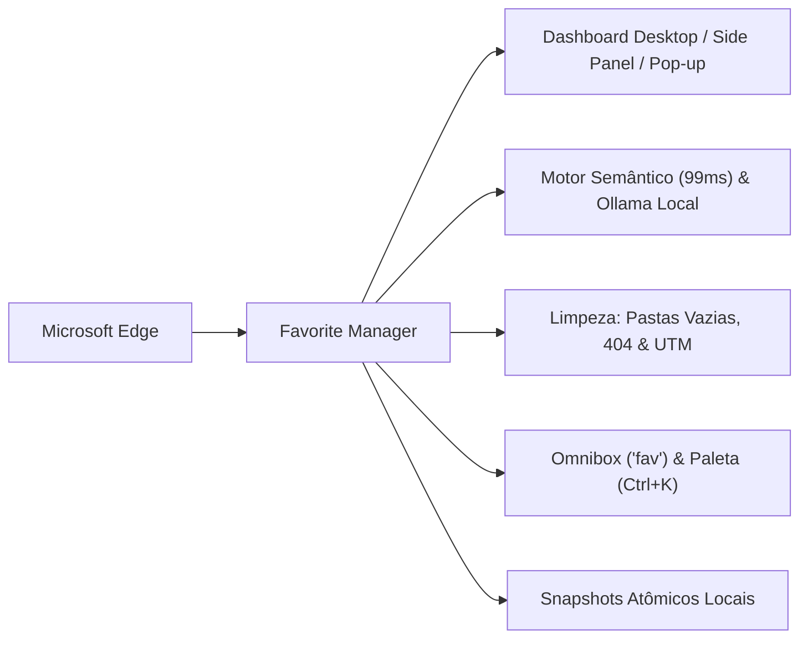

# 🌟 Favorite Manager

> **Gerenciador profissional, ultrarrápido e inteligente de favoritos para Microsoft Edge (Manifest V3 + React 18 + TypeScript + Tailwind CSS)**
> 
> 📄 **Manual Completo do Projeto**: Para uma explicação aprofundada de arquitetura, algoritmos e guia ilustrado, consulte o arquivo [`EXPLICACAO_DO_PROJETO.md`](./EXPLICACAO_DO_PROJETO.md).

---

## 🚀 Visão Geral

O **Favorite Manager** substitui e expande o gerenciador nativo do Microsoft Edge, trazendo uma experiência de nível desktop projetada para suportar grandes volumes de dados (**mais de 3.500 favoritos**) com máxima fluidez, privacidade absoluta e ferramentas avançadas de inteligência semântica e manutenção.



---

## ✨ Principais Funcionalidades

### 1. ⚡ Motor Semântico Ultrarrápido (< 0,2s para 3.500+ Links)
- Analisa **3.511 favoritos em apenas ~99ms** de forma puramente local, sem depender de nuvem ou APIs pagas.
- Agrupa a coleção em **18 categorias mestres** com dezenas de **subpastas inteligentes**:
  - **Programação, Dev & IA**: *Inteligência Artificial*, *Repositórios*, *Documentações*, *Comunidade*, *Ferramentas*.
  - **Jogos & Games**: *Sony & PlayStation*, *Nintendo*, *Xbox*, *PC & Lojas (Steam/PoE)*, *Mods*, *Wikis*, *Emuladores*.
  - **Eletroeletrônica**: *Instalações Elétricas & Aterramento*, *Componentes & Datasheets*, *Circuitos*, *Microcontroladores (Arduino/ESP32)*.
  - **Mecânica & Engenharia**: *Automotiva*, *Técnico Mecânico & Inspeção*, *Usinagem & Pesados*, *CAD 3D*.
  - **Música**: *CCB & Hinários*, *Instrumentos & Luthiaria*, *Partituras & Cifras*, *Teoria & Solfejo*, *Streaming & Clássica*.
  - **Estudos & Educação**: *Concursos*, *Livros PDF*, *Faculdades*, *Idiomas*, *Exatas*, *Humanas*.
- Suporte opcional a modelos generativos locais via **Ollama** (`http://localhost:11434`) em lotes controlados com barra de progresso.

### 2. 🧹 Exclusão Segura de Pastas Vazias (Algoritmo Bottom-Up)
- Varredura recursiva pós-ordem que identifica e apaga apenas pastas que ficarem **100% desocupadas** após a movimentação dos links.
- **Blindagem Dupla**: Pastas raiz do sistema (`0` Raiz, `1` Barra de favoritos, `2` Outros favoritos, `mobile`) são inalteráveis. O sistema utiliza `chrome.bookmarks.remove`, impedindo nativamente a exclusão de qualquer pasta que possua favoritos dentro.
- Opção automática integrada ao modal de organização por IA e botão rápido **"Excluir Todas as Pastas Vazias"** na Central de Limpeza.

### 3. 🔍 Verificador de Links Quebrados & 404 (Wayback Machine)
- Scanner de integridade com conexões paralelas em lote e timeout seguro de 6 segundos.
- Identifica páginas fora do ar (`404 Não Encontrado`, `Erro 500+`, falhas de DNS e timeout).
- Para cada link caído, fornece um atalho direto para o **Wayback Machine (Archive.org)** para recuperar o conteúdo salvo no passado.
- Exclusão seletiva ou remoção em massa de links mortos.

### 4. ⚡ Auto-Organização em Tempo Real (`Ctrl + D`)
- Listener no Service Worker (`chrome.bookmarks.onCreated`): ao salvar qualquer página pelo navegador (`Ctrl+D` ou estrela), a extensão categoriza e move o link automaticamente para a subpasta correta.
- Notificação nativa do Windows/Edge confirmando a pasta de destino.
- Botão seletor no cabeçalho: **Auto-Organizar: ON/OFF**.

### 5. 🧹 Higienizador de URLs e Removedor de Rastreadores (UTM / Afiliados)
- Remove parâmetros espiões e de campanhas (`utm_source`, `utm_medium`, `fbclid`, `gclid`, `si`, `igshid`, `mc_cid`, etc.).
- Preserva intactos os parâmetros funcionais de vídeos do YouTube (`v=...`) e páginas legítimas.
- Higienização em lote com visualização de antes e depois.

### 6. 🏷️ Enriquecedor de Títulos Genéricos
- Detecta links salvos com nomes como *"Nova guia"*, *"Home"*, *"Início"*, ou que repetem a URL crua.
- Faz a leitura invisível da tag `<title>` real da página em segundo plano e renomeia o favorito.

### 7. ⌨️ Omnibox do Edge (`fav <termo>`) e Paleta de Comandos (`Ctrl + K`)
- **Omnibox na barra do Edge**: digite `fav`, aperte `Espaço` e busque favoritos em tempo real direto na barra de navegação.
- **Paleta de Comandos (Ctrl+K / Ctrl+Shift+F)**: busca instantânea estilo Spotlight/Raycast com atalhos de teclado (`↑`, `↓`, `Enter`).

### 8. 📄 Exportador para Markdown (Awesome List `README.md`)
- Converte toda a hierarquia de favoritos em um arquivo `favoritos_awesome_list.md`.
- Gera **Sumário navegável com âncoras** (`📑 Índice Geral`), categorias mestres e subpastas formatadas prontas para publicação no **GitHub**, **Notion** ou **Obsidian**.

### 9. 🛡️ Snapshots Atômicos Locais
- Gravação de pontos de restauração antes de qualquer alteração estrutural no armazenamento local (`unlimitedStorage`).
- Histórico visual com data e hora para auditoria e recuperação em caso de imprevistos.

### 10. 📱 Suporte Completo ao Edge Side Panel
- Interface responsiva com layout adaptado para a barra lateral do Microsoft Edge, permitindo consultar links sem sair da página de navegação atual.

---

## 📦 Como Instalar no Microsoft Edge

A pasta pré-compilada `dist/` já está inclusa no projeto e pronta para execução imediata:

1. Abra o **Microsoft Edge** e navegue até:
   ```text
   edge://extensions/
   ```
2. No menu lateral esquerdo, ative a chave **"Modo de desenvolvedor"** (*Developer mode*).
3. Clique em **"Carregar sem compactação"** (*Load unpacked*).
4. Selecione a pasta **`dist`** deste projeto.
5. Pronto! O **Favorite Manager** estará ativo na barra de ferramentas.

---

## 🛠️ Scripts para Desenvolvedores

Se desejar modificar ou compilar o código-fonte:

```bash
# Instalar dependências
npm install

# Modo de desenvolvimento com Mock Provider (abre no navegador)
npm run dev

# Compilar para produção (gera pasta dist/)
npm run build

# Rodar os testes automatizados (Vitest, pasta tests/)
npm test

# Gerar o pacote Favorite-Manager.zip para a loja do Edge
npm run package
```

Política de privacidade: [docs/PRIVACIDADE.md](docs/PRIVACIDADE.md).

---

## 📁 Estrutura do Código-Fonte

```text
edge-favorite-manager/
├── public/                 # Manifest V3 e ícones da extensão
├── src/
│   ├── ai/                 # Motor Semântico Heurístico (99ms) e Ollama
│   ├── background/         # Service worker: Omnibox, listener Ctrl+D, CORS fetch
│   ├── components/         # Componentes React (Layout, Modais, Limpeza, Paleta Ctrl+K)
│   ├── hooks/              # useBookmarks (estado mestre reativo)
│   ├── services/           # Regras de negócio: bookmarks, health, cleanup, backup
│   ├── types/              # Interfaces TypeScript
│   └── utils/              # Utilitários de data, URL e busca difusa
├── dist/                   # Build compilado de produção pronto para o Edge
├── EXPLICACAO_DO_PROJETO.md# Documentação detalhada da arquitetura e recursos
└── README.md               # Este arquivo de referência
```

---

*Favorite Manager — Organização profissional, privacidade absoluta e máxima performance para os seus favoritos.*
