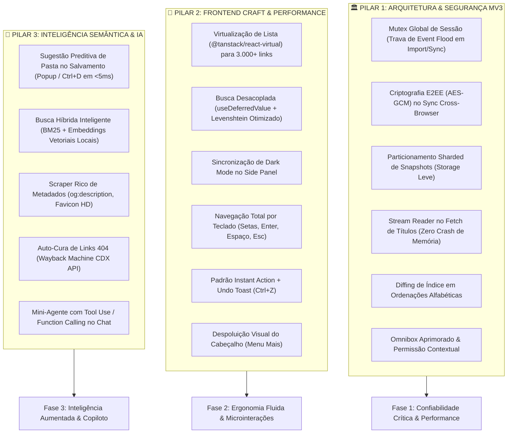

# 🚀 Plano Estratégico de Evolução e Melhorias Inteligentes
**Favorite Manager for Microsoft Edge & Chromium** — Arquitetura, Frontend Craft & Inteligência Artificial.

> Documento de planejamento técnico consolidado a partir da auditoria forense multiagente realizada em **25 de setembro de 2026**.
> Destinado a orientar os próximos ciclos de desenvolvimento e refatorações no projeto.

---

## 🧭 Visão Geral

O **Favorite Manager** já possui uma base sólida:
- Manipulação hierárquica segura com chaves compostas (`parentId:folderTitle`);
- Proteção nativa de nós raiz (`0`, `1`, `2`, `3`, `mobile`, `synced`);
- Motor de classificação semântica com mais de 250 domínios especializados e execução em `< 5ms`;
- Padronização em Title Case rigorosa com preservação de siglas técnicas (`IA`, `CCB`, `ROMs`, `CAD`, `3D`, `DIY`, `PC`, etc.);
- Integração local com Ollama LLM e cultura de snapshots preventivos de segurança.

Este plano organiza as próximas implementações em **3 Pilares Fundamentais** e define um **Roteiro em 3 Fases** para transformar a extensão em uma ferramenta ultrarrápida, ergonomicamente refinada e com inteligência preditiva no dia a dia do usuário.



---

## 🏛️ PILAR 1: Arquitetura & Estabilidade Crítica (Manifest V3)

### 1.1. Mutex Global de Sessão contra Event Flood e Condições de Corrida
- **Diagnóstico**: Durante a importação de um backup com milhares de links (`importer.ts`) ou sincronização remota (`twoWayMerge.ts`), o browser dispara milhares de eventos `onCreated` síncronos no [`src/background/index.ts`](../src/background/index.ts). Sem trava, o Service Worker tenta auto-organizar todos em paralelo, gerando condições de corrida, pastas duplicadas por concorrência e inundando a fila de notificações do Windows/Edge.
- **Implementação**:
  - Utilizar a API em memória `chrome.storage.session` do Manifest V3:
    ```ts
    // Ao iniciar importação ou sync em massa:
    await chrome.storage.session.set({ isBulkOperating: true });
    ```
  - No listener `chrome.bookmarks.onCreated`:
    ```ts
    const { isBulkOperating } = await chrome.storage.session.get('isBulkOperating');
    if (isBulkOperating) return; // Supressão total de reações automáticas e notificações
    ```
  - Liberar a flag com garantia `finally` ao término da operação.

### 1.2. Criptografia E2EE (AES-GCM) no Sync Cross-Browser P2P
- **Diagnóstico**: Em [`src/services/sync/syncService.ts`](../src/services/sync/syncService.ts), a sincronização usa o broker público HiveMQ (`broker.hivemq.com:8884`) em texto claro. Qualquer terceiro conectado ao broker pode inspecionar o histórico e links do usuário.
- **Implementação**:
  - Utilizar a **Web Crypto API** nativa do Chromium (sem dependências externas).
  - Derivar uma chave simétrica da `syncKey` do usuário usando **PBKDF2** (com salt determinístico) e criptografar todos os pacotes MQTT com cifra **AES-GCM de 256 bits**.
  - O broker trafegará estritamente blocos criptografados ilegíveis.

### 1.3. Particionamento e Sharding de Snapshots no `chrome.storage.local`
- **Diagnóstico**: O arquivo [`src/services/backup/index.ts`](../src/services/backup/index.ts) armazena 15 snapshots completos serializados em uma única chave monolítica `efm_snapshots`. Em bibliotecas de 4.000 links, isso força leitura e regravação de até 30 MB de JSON a cada operação simples.
- **Implementação**:
  - Dividir em duas camadas:
    1. `efm_snapshots_index`: array leve contendo apenas metadados (`id`, `timestamp`, `label`, `totalBookmarks`), pesando `< 2 KB`. Permite listar o histórico instantaneamente.
    2. `efm_snapshot_data_${id}`: registro isolado gravado individualmente sob demanda.
  - Elimina congelamento de I/O e estouro de cotas de armazenamento.

### 1.4. Stream Reader com Early-Abort no Fetch de Títulos
- **Diagnóstico**: No [`src/background/index.ts`](../src/background/index.ts), `FETCH_PAGE_TITLE` invoca `await res.text()`. Ao encontrar PDFs grandes ou arquivos binários, aloca megabytes de heap e arrisca crash do Service Worker.
- **Implementação**:
  - Ler o corpo da resposta em streaming usando `ReadableStreamDefaultReader` em blocos de 8 KB até encontrar `</title>` ou `</head>` (ou limite máximo de 32 KB).
  - Cancelar imediatamente o stream (`reader.cancel()`) e abortar a requisição (`controller.abort()`).

### 1.5. Diffing de Índice em Ordenações Alfabéticas
- **Diagnóstico**: Em [`sortFoldersAlphabetically`](../src/services/bookmarks/hierarchy.ts), o loop dispara `bookmarksService.move` para cada item da pasta, mesmo que ele já esteja no índice correto.
- **Implementação**:
  - Verificar `if (node.index === i) continue;` antes de chamar o move. Reduz chamadas de IPC em mais de 80%.

### 1.6. Aprimoramento do Omnibox e Permissões Opcionais
- **Diagnóstico**: O Omnibox não tem sugestão padrão e, ao pressionar Enter sem selecionar item, redireciona para o Bing em vez de buscar nos favoritos. A permissão `<all_urls>` exige justificativa severa na Store.
- **Implementação**:
  - Definir `chrome.omnibox.setDefaultSuggestion({ description: '🔍 Buscar no Favorite Manager: <match>%s</match>' })`.
  - Ao pressionar Enter, abrir a extensão filtrando pelo termo: `index.html#search=${encodeURIComponent(text)}`.
  - Migrar `<all_urls>` para `optional_host_permissions: ["<all_urls>"]`, solicitando acesso apenas quando o usuário ativar a checagem de links quebrados ou busca de títulos.

---

## 🎨 PILAR 2: Frontend Craft, Performance & Ergonomia (UI/UX)

### 2.1. Virtualização de Lista (`@tanstack/react-virtual`)
- **Diagnóstico**: [`MainContent.tsx`](../src/components/layout/MainContent.tsx) renderiza todos os itens no DOM (`items.map`). Com 3.000+ favoritos, são criados mais de 45.000 nós no DOM, causando quedas de FPS para `< 20 FPS` e consumo de RAM de 180 MB.
- **Implementação**:
  - Instalar e integrar `@tanstack/react-virtual` no contêiner com rolagem.
  - Renderizar apenas os ~25 itens visíveis na viewport (tanto no modo lista quanto no modo cards), garantindo **60 FPS fluidos** em qualquer tamanho de acervo.

### 2.2. Busca Desacoplada e Otimizada (`useDeferredValue` + Heurística)
- **Diagnóstico**: Em [`useBookmarks.ts`](../src/hooks/useBookmarks.ts) e [`search.ts`](../src/utils/search.ts), cada tecla digitada executa a matriz de Levenshtein síncrona em todas as palavras de milhares de itens, travando o cursor por 150ms–350ms.
- **Implementação**:
  - Aplicar `const deferredQuery = useDeferredValue(searchQuery);`.
  - Priorizar correspondência direta por substring (`indexOf`); só acionar Levenshtein como fallback para buscas com 4+ caracteres.
  - Cachear instância de `Intl.Collator` para ordenações ultravelozes.

### 2.3. Sincronização do Modo Escuro no Painel Lateral
- **Diagnóstico**: [`SidePanelContent.tsx`](../src/components/sidepanel/SidePanelContent.tsx) não chama `useTheme()`, mantendo o tema claro mesmo quando o usuário escolhe modo escuro.
- **Implementação**:
  - Conectar `useTheme()` na inicialização do frame lateral para sincronizar a classe `.dark` no elemento raiz.

### 2.4. Ergonomia e Acessibilidade em Modais
- **Diagnóstico**: Em [`Modal.tsx`](../src/components/common/Modal.tsx), clicar no backdrop escuro fora da janela não a fecha. No Side Panel (340px de largura), a modal de IA de 672px sofre esmagamento de texto e botões.
- **Implementação**:
  - Adicionar `onClick={onClose}` no contêiner do backdrop.
  - Adicionar suporte a **Focus Trap** e fechamento com `Escape`.
  - No Side Panel, transformar a interface de IA em um **Drawer vertical deslizante** ou abrir em aba completa via botão de 1 clique.

### 2.5. Navegação Contínua por Teclado (Padrão Linear / Raycast)
- **Implementação**:
  - Setas `ArrowDown` e `ArrowUp` movem o foco na lista principal.
  - `Enter` abre o favorito focado em nova guia; `Shift+Enter` em nova janela; `Espaço` abre a gaveta de detalhes ([`RightInspector.tsx`](../src/components/layout/RightInspector.tsx)).
  - No `CommandPaletteModal.tsx` (`Ctrl+K`), adicionar `scrollIntoView({ block: 'nearest' })` no item ativo e carregar os favicons reais dos sites.

### 2.6. Padrão "Instant Action + Undo Toast" (`Ctrl+Z`)
- **Implementação**:
  - Eliminar modais bloqueantes de confirmação para exclusões unitárias.
  - Executar a ação imediatamente e exibir um Toast flutuante de 5 segundos no rodapé:
    > *"Favorito excluído • **Desfazer (Ctrl+Z)***"
  - Respaldado pela infraestrutura de restauração imediata já existente no projeto.

### 2.7. Despoluição do Cabeçalho (`Header.tsx`)
- **Implementação**:
  - Agrupar ações secundárias (Idioma, Tema, Workspaces, Importar, Sync) dentro de um menu discreto `"Mais / Configurações"`.
  - Deixar em evidência no topo apenas: Busca central expandida, `+ Favorito` e `Organizar com IA`.

---

## 🧠 PILAR 3: Inteligência Semântica & Copiloto de IA

### 3.1. Sugestão Preditiva de Pasta no Salvamento (Instant Win)
- **Diagnóstico**: Ao abrir o popup para salvar a aba ativa ([`SaveCurrentTabCard.tsx`](../src/components/popup/SaveCurrentTabCard.tsx)), a extensão coloca passivamente na raiz.
- **Implementação**:
  - Disparar `classifyBookmarkIntelligently(activeTab.title, activeTab.url)` (< 5ms).
  - Mapear para a pasta mais próxima existente via `matchWithExistingFolders`.
  - Exibir no card de salvamento:
    > 💡 **Pasta Sugerida:** `Dev & IA / Documentação` *(Confiança: 95%)* `[Salvar Aqui]`
  - Oferecer pills de tags rápidas sugeridas (`#github`, `#react`, `#frontend`).

### 3.2. Busca Híbrida Inteligente (BM25 + Embeddings Vetoriais Locais)
- **Implementação**:
  - **Etapa 1 (BM25 sem dependências)**: Ponderar a raridade e frequência dos termos no título, URL e caminho da pasta, elevando resultados relevantes ao topo.
  - **Etapa 2 (Busca Semântica por Significado)**:
    - Utilizar o endpoint `/api/embeddings` do Ollama ou modelo leve via WASM (`all-minilm` / `transformers.js`).
    - Salvar os vetores compactos no IndexedDB local.
    - O usuário pesquisa por conceito (*"onde investir dinheiro"*) e encontra favoritos da B3 ou Tesouro Direto mesmo sem palavras coincidentes.

### 3.3. Scraper Rico de Metadados em Background
- **Implementação**:
  - Enriquecer favoritos sem título ou antigos capturando:
    - `title`: `<title>` ou `og:title`;
    - `description`: `meta[name="description"]` ou `og:description` (até 200 caracteres);
    - `favicon`: ícone de alta resolução.
  - Indexar as descrições localmente, permitindo busca pelo conteúdo das páginas.

### 3.4. Auto-Cura de Links 404 (Wayback Machine CDX API)
- **Implementação**:
  - Na Central de Limpeza ([`CleanupView.tsx`](../src/components/cleanup/CleanupView.tsx)), ao detectar status 404 ou domínio inativo:
    - Consultar a API pública do Archive.org (`https://archive.org/wayback/available?url=...`).
    - Exibir botão de ação imediata:
      > `[⚡ Restaurar Snapshot do Archive.org]`

### 3.5. Mini-Agente Autônomo com Function Calling (Tool Use)
- **Implementação**:
  - Permitir que o Mini-Agente execute comandos diretos solicitados em linguagem natural no chat:
    - Ferramentas registradas: `create_folder`, `move_bookmarks`, `clean_empty_folders`, `tag_bookmarks`.
    - Exemplo de instrução do usuário:
      > *"Crie uma pasta chamada 'Tecnologia / Inteligência Artificial', mova todos os links do ChatGPT e Claude para lá e me mostre o que foi feito."*
    - O agente gera a prévia de confirmação e executa com snapshot de segurança.

---

## 📅 ROTEIRO DE IMPLEMENTAÇÃO EM 3 FASES

| Fase | Foco Principal | Entregas Chave | Complexidade |
|---|---|---|---|
| **Fase 1** | **Confiabilidade & Performance** | • Virtualização com `@tanstack/react-virtual`<br>• `useDeferredValue` na busca<br>• Mutex de sessão no background contra event loops<br>• Correção do Dark Mode no Side Panel<br>• Backdrop click e Focus Trap no modal | **Alta Prioridade / Médio Esforço** |
| **Fase 2** | **Ergonomia & Fluidez** | • Sugestão preditiva de pasta ao salvar a aba atual<br>• Navegação contínua por teclado (`Setas, Enter, Espaço`)<br>• Favicons reais e scroll no `Ctrl+K`<br>• Undo Toast (`Ctrl+Z`) para exclusões<br>• Despoluição do Header | **Alta Prioridade / Baixo Esforço** |
| **Fase 3** | **Inteligência Aumentada** | • Criptografia E2EE (AES-GCM) no sync cross-browser<br>• Busca híbrida BM25 + Embeddings Semânticos<br>• Scraper de descrições e OpenGraph<br>• Auto-cura de 404 via Wayback Machine<br>• Function Calling no Mini-Agente | **Inovação / Médio-Alto Esforço** |

---

## 🎯 Próximo Passo ao Retomar o Projeto

Ao retornar para implementar as mudanças:
1. Começar pela **Fase 1 (Item 1.1 e 2.1)**: implementar o Mutex global de sessão no Service Worker e a Virtualização da Lista com `@tanstack/react-virtual`.
2. Validar com `npx tsx scratch/test-full-suite.ts` e `npm run build`.
3. Prosseguir sequencialmente para a Fase 2 (Sugestão no Salvamento e Teclado).

---
*Documento registrado em repositório para preservação de arquitetura e continuidade do desenvolvimento.*
