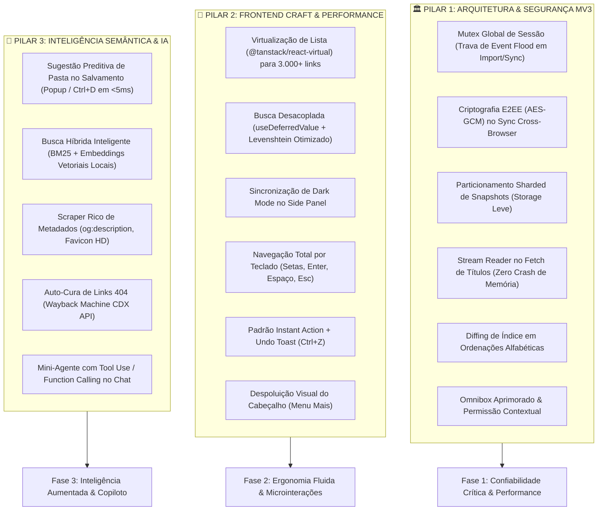

# 🗺️ Roadmap — Favorite Manager
**Favorite Manager** — Arquitetura, Frontend Craft & Inteligência Artificial.

> Documento de planejamento técnico consolidado a partir da auditoria forense multiagente realizada em **25 de setembro de 2026**.
> Destinado a orientar os próximos ciclos de desenvolvimento e refatorações no projeto.

---

## 🛠️ FASE 0 — Prontidão para Publicação (prioridade máxima)

> Adicionada após a auditoria de **30 de setembro de 2026**. Passo a passo das tarefas: seção "Fase 0 em detalhe", logo abaixo.

**Objetivo:** publicar na Edge Add-ons Store sem falhas de segurança nem risco de perda de favoritos. Vem antes de qualquer item das Fases 1–3.

| Etapa | Entrega | Por que vem nesta ordem |
|---|---|---|
| **T. Testes** | Suíte versionada em `tests/` com `npm test`, sem dados pessoais | As correções seguintes precisam de teste antes |
| **A. Segurança** | Sync cifrado ponta a ponta (ou removido); regra de CORS do Ollama só para a extensão; limpeza de pastas que nunca apaga conteúdo | Hoje os favoritos vazam no broker público e qualquer site acessa o Ollama local. Bloqueia a publicação |
| **C. Integridade** | Ordenação A-Z correta; trava em massa também na restauração; sync e importação sem pastas raiz duplicadas; modo "preservar" sem renomear; desfazer na posição original | Bugs que bagunçam ou movem favoritos do usuário |
| **D. Experiência** | Atalhos que respeitam campos e modais; timeout e cancelar no Ollama; checagem de links confiável; textos corrigidos | Bugs visíveis no uso diário |
| **E. Loja** | Permissões mínimas (`<all_urls>` opcional), omnibox buscando nos favoritos, versão alinhada, política de privacidade, pacote e checklist no Edge | Requisitos de aprovação na loja |

**Status (01/10/2026):** código da Fase 0 concluído e na `main` (PRs #1 a #11), `npm test` 87/87, build e CI passando. Política de privacidade publicada em https://gist.github.com/Neguchads/c5a554a1d03ea38f4840eb0a9d331521. Material da loja pronto em `docs/loja/` e guia do Partner Center em `docs/LOJA.md`. **Falta (usuário):** teste manual no Edge (Tarefa E5) e envio no Partner Center (o rascunho existente ainda tem nome e pacote antigos).

**Feito depois da Fase 0 (30/09–01/10):**
- CI no GitHub Actions (`npm test` + `npm run build` em todo PR) e versão única no `package.json` (`scripts/manifestVersion.ts`).
- Nome **Favorite Manager**, ícones de estrela, pacote npm `favorite-manager`.
- Sync: replay recusado após reconectar, chave antiga `FAV-####-XXXX` recusada, eventos nativos do navegador (Ctrl+D, estrela, gerenciador) sincronizam com uma página da extensão aberta.
- Organizar e importar com IA reaproveitam pastas existentes em qualquer nível (sem duplicar pastas aninhadas).
- Snapshots em chaves separadas com índice, trava entre páginas (`navigator.locks`) e migração do formato antigo.
- Atalhos: menu de contexto e modais bloqueiam a lista; Esc de overlay não limpa seleção; `#search=` reage a `hashchange`.
- Regra do Ollama só na porta 11434 (inclui `[::1]`); barra de favoritos reconhecida por `PERSONAL_TOOLBAR_FOLDER` na importação.
- Etiqueta de pasta dos favoritos mostra a pasta certa; logo do cabeçalho é o ícone da extensão.

**Critério de pronto:** `npm test` e `npm run build` passando, checklist manual no Edge concluído e pacote `1.2.0` enviado (envio só com confirmação do usuário).

### Status dos itens das Fases 1–3 (conferido no código em 01/10/2026)

| Item | Status |
|---|---|
| 1.1 Mutex de sessão | Feito em importação, sync e restauração, com contador e janela de carência (`bulkLock.ts`). |
| 1.2 E2EE no sync | Feito (AES-GCM + HKDF, `crypto.ts`). |
| 1.3 Sharding de snapshots | Feito (uma chave por snapshot, índice, `navigator.locks`, migração). |
| 1.4 Stream no fetch de títulos | Feito. |
| 1.5 Diffing de índice | Feito e corrigido (Tarefa C1). |
| 1.6 Omnibox e permissões opcionais | Feito (Tarefa E2). |
| 2.1–2.7 | Feitos, com os bugs de teclado e undo corrigidos (Tarefas C6 e D1). |
| 3.1, 3.2 (BM25), 3.4, 3.5 | Feitos. Embeddings (3.2 etapa 2) e 3.3 ficam para depois da publicação. |


---

## 🔧 Fase 0 em detalhe: tarefas passo a passo

> **Para agentes:** execute tarefa por tarefa, na ordem. Marque `- [x]` ao concluir. Cada bloco termina num ponto de commit, mas **commit só com autorização do usuário** (regra do `AGENTS.md`). Esta fase tem prioridade sobre as Fases 1–3 do roadmap.

**Objetivo:** fechar as falhas de segurança e de integridade de dados achadas na auditoria, versionar os testes e preparar o pacote para a Edge Add-ons Store.

**Arquitetura:** nada muda na estrutura. As correções são cirúrgicas nos arquivos existentes, com dois helpers novos: `src/services/sync/crypto.ts` (cifra do sync) e `src/services/bookmarks/bulkLock.ts` (trava de operação em massa). Os testes passam a morar em `tests/` e rodam com Vitest contra o `MockBookmarksService` (escolhido automaticamente fora do navegador em `src/services/bookmarks/index.ts`).

**Stack:** React 18, TypeScript 5 strict, Vite 5, Web Crypto API (nativa), Vitest 3 (nova dependência só de desenvolvimento).

**Origem:** relatório da auditoria de 30/09/2026 (sessão Claude Code, branch `claude/favorite-manager-audit-bdc274`). Estado de partida: `main` em `a8da6c0`, igual ao GitHub, build passando.

### Restrições globais

- `npm run build` e `npm test` passando ao fim de cada tarefa.
- Nenhuma dependência nova de runtime. Única dependência nova: `vitest` em `devDependencies`. ESLint fica fora: o `tsc` strict já cobre o essencial e o ESLint traria 4+ pacotes.
- Nenhum dado pessoal em `tests/` (os favoritos reais do usuário continuam fora do repositório, em `scratch/`).
- Identificadores e commits em inglês; comentários e textos da UI em pt-BR.
- Nada de `git reset`, `stash`, `clean` ou troca de branch (regra do `AGENTS.md`).

### Foco de revisão (casos que os testes das tarefas precisam cobrir)

1. Catálogo de 3.000+ favoritos no sync pode passar do tamanho máximo de mensagem do broker. Esperado: envio em lotes de 200 itens. Teste na Tarefa A1.
2. Mensagem de sync com chave errada, corrompida ou reenviada (replay). Esperado: descartada sem tocar nos favoritos. Teste na Tarefa A1.
3. Pasta com o mesmo nome em raízes diferentes ("Barra de favoritos/Estudos" e "Outros favoritos/Estudos") durante sync ou importação. Esperado: não se mesclam. Testes nas Tarefas C3 e C4.
4. Erro no meio de uma restauração, importação ou merge. Esperado: a trava `isBulkOperating` é liberada mesmo com exceção. Teste na Tarefa C2.
5. Usuário digitando num campo ou num `<select>` com modal ou toast aberto. Esperado: nenhum atalho global dispara. Checklist manual na Tarefa D1.


### Bloco T — Infra de testes (primeiro, para as correções serem feitas com teste antes)

#### Tarefa T1: Vitest + testes versionados

**Arquivos:**
- Modificar: `package.json` (script `test`, `vitest` em devDeps)
- Modificar: `vite.config.ts` (bloco `test`)
- Modificar: `tsconfig.json` (`include` com `tests`)
- Criar: `tests/search.test.ts`, `tests/classifier.test.ts`, `tests/htmlRoundtrip.test.ts`

- [x] **Passo 1:** instalar: `npm install -D vitest@^3`
- [x] **Passo 2:** em `package.json`, adicionar `"test": "vitest run"` em `scripts`.
- [x] **Passo 3:** em `vite.config.ts`, adicionar na primeira linha `/// <reference types="vitest/config" />` e, dentro de `defineConfig`, o bloco:
  ```ts
  test: {
    environment: 'node',
    include: ['tests/**/*.test.ts'],
  },
  ```
- [x] **Passo 4:** em `tsconfig.json`, trocar `"include": ["src", "vite.config.ts"]` por `"include": ["src", "tests", "vite.config.ts"]`.
- [x] **Passo 5:** portar de `scratch/test-full-suite.ts` e `scratch/test-new-features.ts` só as asserções que **não** leem arquivo pessoal, usando dados sintéticos. Mínimo:
  ```ts
  // tests/classifier.test.ts
  import { describe, it, expect } from 'vitest';
  import { capitalizeFolderWords, parseChatActionIntent } from '../src/ai/classifier';

  describe('capitalizeFolderWords', () => {
    it('preserva siglas técnicas', () => {
      expect(capitalizeFolderWords('dev & ia / api')).toBe('Dev & IA / API');
    });
  });

  describe('parseChatActionIntent', () => {
    it('entende criar pasta e mover links', () => {
      const items = [
        { id: 'b1', title: 'Duolingo', url: 'https://www.duolingo.com/' },
        { id: 'b2', title: 'Duolingo Stories', url: 'https://stories.duolingo.com/' },
        { id: 'b3', title: 'GitHub', url: 'https://github.com/' },
      ];
      const result = parseChatActionIntent(
        'Crie a pasta Estudos/Inglês e mova todos os links do Duolingo para lá',
        items,
        new Set<string>()
      );
      expect(result?.targetFolder).toBe('Estudos / Inglês');
      expect(result?.plan.moves.map((m) => m.bookmarkId)).toEqual(['b1', 'b2']);
    });
  });
  ```
  Para `tests/search.test.ts`, ler a assinatura de `scoreSearchRelevance` (`src/utils/search.ts:176`) e provar que título exato fica acima de título que só contém o termo.
- [x] **Passo 6:** `tests/htmlRoundtrip.test.ts`: exportar uma árvore sintética com `generateNetscapeHtml` e reler com `parseNetscapeHtml`. Esperado: mesmos títulos, URLs e pastas, incluindo títulos com `&`, `<` e aspas.
- [x] **Passo 7:** rodar `npm test` (esperado: PASS) e `npm run build` (esperado: sem erros).
- **Ponto de commit:** `test: add vitest and versioned test suite`

---

### Bloco A — Segurança (bloqueia a publicação)

#### Tarefa A1: Sync com criptografia ponta a ponta ⚠️ exige decisão do usuário antes

**Decisão tomada:** (a) criptografar. Opções que eram consideradas: (a) criptografar, **recomendado** se o usuário usa Chrome e Edge juntos; ou (b) remover o recurso (`paho-mqtt`, `@types/paho-mqtt`, `src/services/sync/*`, `useSync.ts`, `CrossBrowserSyncModal.tsx`, entrada no menu "Mais"), já que o Edge sincroniza favoritos pela conta Microsoft. Se for (b), esta tarefa vira só remoção + build.

**Problema:** `syncService.ts:118` publica o catálogo em JSON claro no broker público `broker.hivemq.com`. Quem assinar `favmanager/sync/#` lê os favoritos de todos os usuários e pode apagar ou injetar favoritos (`:240`, `:246`). A chave `FAV-####-XXXX` usa `Math.random()` (`browserDetect.ts:68`).

**Arquivos:**
- Criar: `src/services/sync/crypto.ts`
- Modificar: `src/services/sync/browserDetect.ts:68-76` (`generateSyncKey`)
- Modificar: `src/services/sync/syncService.ts` (`connect`, `broadcastMessage`, `handleIncomingMessage`, `sendCatalogPayload`)
- Teste: `tests/syncCrypto.test.ts`

- [x] **Passo 1: teste que falha**
  ```ts
  // tests/syncCrypto.test.ts
  import { describe, it, expect } from 'vitest';
  import { deriveSyncMaterial, sealMessage, openMessage } from '../src/services/sync/crypto';
  import { generateSyncKey } from '../src/services/sync/browserDetect';

  describe('sync crypto', () => {
    it('ida e volta com a mesma chave', async () => {
      const { key } = await deriveSyncMaterial('FAV-ABCD-EFGH-JKLM-NPQR-STUV');
      const sealed = await sealMessage(key, { hello: 'mundo' });
      expect(sealed).not.toContain('mundo');
      expect(await openMessage(key, sealed)).toEqual({ hello: 'mundo' });
    });
    it('chave errada ou payload corrompido retorna null', async () => {
      const a = await deriveSyncMaterial('FAV-AAAA-AAAA-AAAA-AAAA-AAAA');
      const b = await deriveSyncMaterial('FAV-BBBB-BBBB-BBBB-BBBB-BBBB');
      const sealed = await sealMessage(a.key, { x: 1 });
      expect(await openMessage(b.key, sealed)).toBeNull();
      expect(await openMessage(a.key, sealed.slice(0, -4) + 'AAAA')).toBeNull();
      expect(await openMessage(a.key, 'lixo')).toBeNull();
    });
    it('tópico não revela a chave e é estável', async () => {
      const m1 = await deriveSyncMaterial('FAV-ABCD-EFGH-JKLM-NPQR-STUV');
      const m2 = await deriveSyncMaterial('fav-abcd-efgh-jklm-npqr-stuv');
      expect(m1.topic).toBe(m2.topic);
      expect(m1.topic).toMatch(/^favmanager\/v2\/[0-9a-f]{32}$/);
    });
    it('chave nova tem 20 caracteres aleatórios (100 bits)', () => {
      expect(generateSyncKey()).toMatch(/^FAV(-[A-Z2-9]{4}){5}$/);
    });
  });
  ```
- [x] **Passo 2:** `npm test` → FAIL (módulo `crypto` não existe).
- [x] **Passo 3: implementação**
  ```ts
  // src/services/sync/crypto.ts
  // Cifra ponta a ponta do sync: o broker público só vê bytes ilegíveis.
  const enc = new TextEncoder();
  const dec = new TextDecoder();

  function toHex(bytes: Uint8Array): string {
    return Array.from(bytes, (b) => b.toString(16).padStart(2, '0')).join('');
  }
  function toBase64(bytes: Uint8Array): string {
    let s = '';
    bytes.forEach((b) => (s += String.fromCharCode(b)));
    return btoa(s);
  }
  function fromBase64(str: string): Uint8Array {
    return Uint8Array.from(atob(str), (c) => c.charCodeAt(0));
  }

  export async function deriveSyncMaterial(syncKey: string): Promise<{ key: CryptoKey; topic: string }> {
    const base = await crypto.subtle.importKey('raw', enc.encode(syncKey.trim().toUpperCase()), 'HKDF', false, [
      'deriveKey',
      'deriveBits',
    ]);
    const hkdf = (info: string) => ({ name: 'HKDF', hash: 'SHA-256', salt: new Uint8Array(0), info: enc.encode(info) });
    const key = await crypto.subtle.deriveKey(hkdf('favmanager-enc-v2'), base, { name: 'AES-GCM', length: 256 }, false, [
      'encrypt',
      'decrypt',
    ]);
    const topicBits = await crypto.subtle.deriveBits(hkdf('favmanager-topic-v2'), base, 128);
    return { key, topic: `favmanager/v2/${toHex(new Uint8Array(topicBits))}` };
  }

  export async function sealMessage(key: CryptoKey, data: unknown): Promise<string> {
    const iv = crypto.getRandomValues(new Uint8Array(12));
    const cipher = await crypto.subtle.encrypt({ name: 'AES-GCM', iv }, key, enc.encode(JSON.stringify(data)));
    const out = new Uint8Array(iv.length + cipher.byteLength);
    out.set(iv, 0);
    out.set(new Uint8Array(cipher), iv.length);
    return toBase64(out);
  }

  export async function openMessage(key: CryptoKey, payload: string): Promise<unknown | null> {
    try {
      const bytes = fromBase64(payload);
      if (bytes.length < 13) return null;
      const plain = await crypto.subtle.decrypt({ name: 'AES-GCM', iv: bytes.slice(0, 12) }, key, bytes.slice(12));
      return JSON.parse(dec.decode(plain));
    } catch {
      return null;
    }
  }
  ```
  E em `browserDetect.ts`:
  ```ts
  export function generateSyncKey(): string {
    const chars = 'ABCDEFGHJKLMNPQRSTUVWXYZ23456789'; // 32 símbolos = 5 bits cada
    const bytes = crypto.getRandomValues(new Uint8Array(20));
    const body = Array.from(bytes, (b) => chars[b % 32]).join('');
    return `FAV-${body.match(/.{4}/g)!.join('-')}`;
  }
  ```
- [x] **Passo 4:** integrar no `syncService.ts`:
  - Guardar `private material: { key: CryptoKey; topic: string } | null`. Em `connect`, chamar `await deriveSyncMaterial(cleanKey)` antes de conectar e assinar `material.topic` (sai o `favmanager/sync/${cleanKey}`).
  - `broadcastMessage` passa a ser `async`: `pahoMsg = new Paho.Message(await sealMessage(this.material.key, message))`.
  - `handleIncomingMessage`: `const msg = await openMessage(this.material.key, rawPayload)`; se `null`, retornar sem fazer nada. Descartar também se `Math.abs(Date.now() - msg.timestamp) > 5 * 60_000` (replay) ou se `msg.syncKey !== this.syncKey`.
  - `sendCatalogPayload`: enviar em lotes de 200 itens (`payload: { items: lote, part, totalParts }`). O receptor aplica cada lote com `applyRemoteCatalogMerge`, que já pula URLs repetidas.
  - Chaves antigas (`FAV-####-XXXX`) continuam aceitas em `connect`, mas a UI (`CrossBrowserSyncModal.tsx`) deve sugerir gerar uma nova.
- [x] **Passo 5:** teste do lote em `tests/syncCrypto.test.ts`: função pura `chunk(items, 200)` exportada de `syncService.ts` ou `crypto.ts`. Com 450 itens, esperado `[200, 200, 50]`.
- [x] **Passo 6:** `npm test` e `npm run build` → PASS. Teste manual: Edge + Chrome com a mesma chave; criar favorito num navegador e ver chegar no outro; no Chrome, abrir `https://www.hivemq.com/demos/websocket-client/`, assinar `favmanager/#` e confirmar que só chega texto ilegível.
- **Ponto de commit:** `fix(sync): end-to-end encrypt sync messages and harden sync keys`

#### Tarefa A2: Regra de CORS do Ollama restrita à extensão

**Problema:** `public/rules/ollama_cors.json:18` (`urlFilter: ":11434/"`) e as regras dinâmicas `1001`/`1002` em `src/background/index.ts:14-94` valem para qualquer site. Hoje qualquer página da web consegue ler o Ollama local do usuário.

**Arquivos:**
- Apagar: `public/rules/ollama_cors.json`
- Modificar: `public/manifest.json` (remover o bloco `declarative_net_request`)
- Modificar: `src/background/index.ts:14-97` (`setupOllamaCorsRules`)

- [x] **Passo 1:** substituir `setupOllamaCorsRules` por:
  ```ts
  // Só reescreve o Origin das chamadas da PRÓPRIA extensão ao Ollama local.
  // Páginas com host_permissions já ignoram CORS; o Ollama só rejeita o Origin chrome-extension://.
  async function setupOllamaOriginRule() {
    if (!chrome.declarativeNetRequest?.updateSessionRules) return;
    try {
      // Limpa as regras antigas, que valiam para qualquer site
      await chrome.declarativeNetRequest.updateDynamicRules({ removeRuleIds: [1001, 1002] });
      await chrome.declarativeNetRequest.updateSessionRules({
        removeRuleIds: [2001],
        addRules: [
          {
            id: 2001,
            priority: 1,
            action: {
              type: chrome.declarativeNetRequest.RuleActionType.MODIFY_HEADERS,
              requestHeaders: [
                { header: 'origin', operation: chrome.declarativeNetRequest.HeaderOperation.SET, value: 'http://localhost' },
              ],
            },
            condition: {
              initiatorDomains: [chrome.runtime.id],
              requestDomains: ['localhost', '127.0.0.1'],
              resourceTypes: [chrome.declarativeNetRequest.ResourceType.XMLHTTPREQUEST],
            },
          },
        ],
      });
    } catch (err) {
      console.warn('Ollama origin rule registration skipped:', err);
    }
  }
  ```
  Chamar no topo do arquivo e em `onInstalled` (regra de sessão some quando o navegador fecha, e o service worker a recria ao subir).
- [x] **Passo 2:** `npm run build`. Teste manual:
  1. Recarregar a extensão em `edge://extensions`.
  2. No modal de IA, clicar em "Testar Conexão". Esperado: conecta.
  3. Abrir `https://example.com`, abrir o DevTools e rodar `fetch('http://localhost:11434/api/tags').then(r => r.json())`. Esperado: erro de CORS.
- **Ponto de commit:** `fix(security): scope Ollama origin rewrite to the extension only`

#### Tarefa A3: `pruneEmptyFolders` nunca apaga conteúdo

**Problema:** em `hierarchy.ts:120-129`, quando `remove` falha (a pasta não está vazia), o código chama `removeTree` e apaga tudo que está dentro.

**Arquivos:** modificar `src/services/bookmarks/hierarchy.ts:115-130`; teste em `tests/hierarchy.test.ts`.

- [x] **Passo 1: teste que falha**, com `vi.mock` do serviço:
  ```ts
  import { describe, it, expect, vi } from 'vitest';
  const removeTree = vi.fn();
  vi.mock('../src/services/bookmarks/index', () => ({
    bookmarksService: {
      remove: vi.fn().mockRejectedValue(new Error("Can't remove non-empty folder")),
      removeTree,
    },
  }));
  import { pruneEmptyFolders } from '../src/services/bookmarks/hierarchy';

  it('não chama removeTree quando remove falha', async () => {
    const tree = [{ id: '0', title: '', children: [{ id: '1', title: 'Barra', parentId: '0', children: [
      { id: '50', title: 'Vazia na memória', parentId: '1', children: [] },
    ] }] }];
    const pruned = await pruneEmptyFolders(tree as any, undefined, new Set(['50']));
    expect(pruned).toBe(0);
    expect(removeTree).not.toHaveBeenCalled();
  });
  ```
- [x] **Passo 2:** `npm test` → FAIL.
- [x] **Passo 3:** trocar o `catch` com `removeTree` por:
  ```ts
  } catch (err) {
    // remove() só falha se a pasta ganhou itens depois da leitura: manter a pasta
    console.warn(`Pasta [${node.id}] ${node.title} não está vazia; mantida.`, err);
    return false;
  }
  ```
- [x] **Passo 4:** `npm test` e `npm run build` → PASS.
- **Ponto de commit (Bloco A):** `fix(security): never remove folder contents when pruning`

---

### Bloco C — Integridade dos favoritos

#### Tarefa C1: Ordenação A-Z correta

**Problema:** `hierarchy.ts:192` compara com o `index` antigo. `[C,B,A]` termina como `[A,C,B]`.

**Arquivos:** modificar `src/services/bookmarks/hierarchy.ts:187-198`; teste em `tests/sort.test.ts`.

- [x] **Passo 1: teste que falha.** Usar o `MockBookmarksService` real (sem `vi.mock`). Criar pasta com C, B, A nessa ordem, rodar `sortFoldersAlphabetically(pastaId, false)` e ler `getChildren`. Esperado: `['A', 'B', 'C']`. Antes, conferir se o `move` do mock segue a regra do Chrome (índice é a posição final, contada sem o item movido quando ele sobe). Se não seguir, ajustar o mock primeiro.
- [x] **Passo 2:** `npm test` → FAIL.
- [x] **Passo 3:**
  ```ts
  // Ordem atual real, atualizada a cada move (o node.index lido antes fica velho)
  const currentOrder = [...children].sort((a, b) => (a.index ?? 0) - (b.index ?? 0)).map((c) => c.id);
  for (let i = 0; i < sortedChildren.length; i++) {
    const node = sortedChildren[i];
    const from = currentOrder.indexOf(node.id);
    if (from === i) continue;
    try {
      // Sempre sobe (from > i): as posições < i já estão finais
      await bookmarksService.move(node.id, { parentId, index: i });
      currentOrder.splice(from, 1);
      currentOrder.splice(i, 0, node.id);
    } catch (err) {
      console.warn(`Erro ao reordenar item [${node.id}] ${node.title}:`, err);
    }
  }
  ```
- [x] **Passo 4:** `npm test` e `npm run build` → PASS.

#### Tarefa C2: Trava única de operação em massa (inclui a restauração)

**Problema:** `restoreSnapshot` (`backup/index.ts:139`) não liga `isBulkOperating`. Com a auto-organização ativa, o service worker move os favoritos restaurados na raiz. A mesma lógica está copiada em `importer.ts:65-69/299-305` e `twoWayMerge.ts:65-69/125-131`.

**Arquivos:**
- Criar: `src/services/bookmarks/bulkLock.ts`
- Modificar: `src/services/backup/index.ts` (`restoreSnapshot`), `src/services/backup/importer.ts`, `src/services/sync/twoWayMerge.ts`
- Teste: `tests/bulkLock.test.ts`

- [x] **Passo 1: teste que falha**, com um `chrome.storage.session` falso em `globalThis`:
  ```ts
  import { it, expect, beforeEach } from 'vitest';
  import { withBulkOperation } from '../src/services/bookmarks/bulkLock';

  const store: Record<string, unknown> = {};
  beforeEach(() => {
    (globalThis as any).chrome = { storage: { session: {
      set: async (o: Record<string, unknown>) => Object.assign(store, o),
    } } };
  });

  it('libera a trava mesmo com erro', async () => {
    await expect(withBulkOperation(async () => {
      expect(store.isBulkOperating).toBe(true);
      throw new Error('falhou no meio');
    })).rejects.toThrow('falhou no meio');
    expect(store.isBulkOperating).toBe(false);
  });
  ```
- [x] **Passo 2:** `npm test` → FAIL.
- [x] **Passo 3:**
  ```ts
  // src/services/bookmarks/bulkLock.ts
  // Liga a trava lida pelo service worker (onCreated) durante operações em massa.
  async function setFlag(value: boolean) {
    try {
      if (typeof chrome !== 'undefined' && chrome.storage?.session) {
        await chrome.storage.session.set({ isBulkOperating: value });
      }
    } catch {}
  }

  export async function withBulkOperation<T>(fn: () => Promise<T>): Promise<T> {
    await setFlag(true);
    try {
      return await fn();
    } finally {
      await setFlag(false);
    }
  }
  ```
- [x] **Passo 4:** envolver o corpo de `restoreSnapshot` (a partir da limpeza) em `withBulkOperation`. Trocar os blocos copiados de `importer.ts` e `twoWayMerge.ts` pelo helper.
- [x] **Passo 5:** `npm test` e `npm run build` → PASS.

#### Tarefa C3: Sync não duplica a pasta raiz

**Problema:** `extractCatalogFromTree` (`twoWayMerge.ts:24`) grava `folderPath` com o nome da raiz ("Barra de favoritos / Estudos"). O receptor cria esse caminho dentro da raiz `'1'`, o que gera `Barra de favoritos/Barra de favoritos/Estudos`. O Chrome em inglês usa "Bookmarks bar", então o problema piora entre navegadores.

**Arquivos:** modificar `src/services/sync/types.ts` (`SyncCatalogItem`), `src/services/sync/twoWayMerge.ts`, `src/services/sync/syncService.ts:278-306`, `src/hooks/useBookmarks.ts:445`; mover `SYSTEM_ROOT_NAMES` de `importer.ts:203` para `hierarchy.ts` (exportado). Teste em `tests/twoWayMerge.test.ts`.

- [x] **Passo 1: testes que falham:**
  - `extractCatalogFromTree` com um favorito em `1 > Estudos` retorna `{ rootId: '1', folderPath: 'Estudos' }`, e um em `2 > Estudos` retorna `{ rootId: '2', folderPath: 'Estudos' }`.
  - Nova função `resolveRemoteTarget(item)`: `{ folderPath: 'Bookmarks bar / Dev' }` (formato antigo, sem `rootId`) vira `{ rootId: '1', path: 'Dev' }`.
- [x] **Passo 2:** `npm test` → FAIL.
- [x] **Passo 3:** adicionar `rootId?: '1' | '2' | '3'` em `SyncCatalogItem`. Em `extractCatalogFromTree`, guardar o id da raiz e montar o caminho sem ela. Em `resolveRemoteTarget`, usar `rootId` se existir; senão, tirar o primeiro segmento quando ele estiver em `SYSTEM_ROOT_NAMES` e mapear para a raiz certa ("outros favoritos"/"other bookmarks" → `'2'`, "móveis"/"mobile" → `'3'`, resto → `'1'`). `applyRemoteCatalogMerge` e `handleRemoteBookmarkCreated` chamam `ensureHierarchicalFolder(path, rootId, map)`; com `path` vazio, a função já devolve a própria raiz.
- [x] **Passo 4:** `npm test` e `npm run build` → PASS.

#### Tarefa C4: Importar o JSON do próprio backup sem pasta fantasma

**Problema:** o JSON do Backup (`BackupView.tsx:69`) contém a árvore inteira, com o nó `0` sem título. No modo "preservar", `importer.ts:214` só desembrulha quando há uma única raiz com nome de sistema. Resultado provável: uma pasta sem nome contendo "Barra de favoritos" e "Outros favoritos".

**Arquivos:** modificar `src/services/backup/importer.ts:85-116` e `:214-222`; teste em `tests/importer.test.ts` (roda com o `MockBookmarksService`).

- [x] **Passo 1: teste que falha.** Importar `exportBookmarksToJson(árvoreSintéticaComRaiz0)` com `strategy: 'preserve'` e `createDedicatedFolder: true`. Esperado dentro de "Importados": os filhos da barra direto, mais a pasta "Outros favoritos" (se tiver itens), e nenhuma pasta com título vazio.
- [x] **Passo 2:** `npm test` → FAIL.
- [x] **Passo 3:** depois do parse do JSON, se `rawTree` tiver um único nó com `id === '0'`, usar os filhos dele. Na etapa de desembrulhar, tratar cada raiz de sistema, pelo título em `SYSTEM_ROOT_NAMES` ou pelo id `'1'`: se for a barra, importar os filhos direto no destino; se for "Outros" ou "Móveis", manter como subpasta com o nome original.
- [x] **Passo 4:** `npm test` e `npm run build` → PASS.

#### Tarefa C5: Modo "preservar" não renomeia pastas

**Problema:** `importer.ts:256` aplica `capitalizeFolderWords` e pode trocar nomes (ex.: `eletroeletrônica` → `Eletrônica`), o que contradiz o nome do modo.

- [x] **Passo 1: teste que falha** em `tests/importer.test.ts`: pasta `minhas receitas` importada no modo preservar mantém o título `minhas receitas`.
- [x] **Passo 2:** em `importRecursive`, usar `const cleanFolderTitle = item.title.trim() || 'Sem nome';`. O Title Case continua só no modo `ai_organize`.
- [x] **Passo 3:** `npm test` e `npm run build` → PASS.

#### Tarefa C6: Desfazer exclusão volta para a mesma posição

**Problema:** `App.tsx:136` recria o favorito no fim da pasta.

**Arquivos:** `src/App.tsx:114-177`, `src/hooks/useBookmarks.ts:437-451`.

- [x] **Passo 1:** em `createBookmark`, adicionar o parâmetro opcional `index?: number` e repassar para `bookmarksService.create({ parentId, title, url, index })`. Conferir se `IBookmarksService.create` e o mock aceitam `index`; se não aceitarem, incluir.
- [x] **Passo 2:** em `handlePromptDelete`, guardar `index: node.index` no `backupItem`, estender o tipo do `undoToast` e chamar `createBookmark(title, url, parentId, index)` no desfazer.
- [x] **Passo 3:** `npm run build`. Teste manual: apagar o 2º favorito de uma pasta, clicar em Desfazer e ver que ele volta como 2º.
- **Ponto de commit (Bloco C):** `fix(bookmarks): correct sort order, bulk lock on restore, sync root paths, import roots and undo position`

---

### Bloco D — UX, teclado e rede

#### Tarefa D1: Atalhos globais respeitam campos e modais

**Problema:** em `App.tsx:221-246`, `isInput` ignora `SELECT`; `Ctrl+Z` com o toast aberto rouba o desfazer do campo de texto; e Delete, setas e Ctrl+A agem na lista mesmo com um modal aberto.

**Arquivos:** `src/App.tsx:217-295`, `src/components/common/Modal.tsx:43-46`, `src/components/common/ConfirmDialog.tsx`.

- [x] **Passo 1:** em `Modal.tsx` e `ConfirmDialog.tsx`, adicionar `role="dialog" aria-modal="true"` na caixa interna (isso também melhora a acessibilidade).
- [x] **Passo 2:** no handler:
  ```ts
  const isInput =
    !!target &&
    (target.tagName === 'INPUT' || target.tagName === 'TEXTAREA' || target.tagName === 'SELECT' || target.isContentEditable);
  const isModalOpen = document.querySelector('[aria-modal="true"]') !== null;
  ```
  No `Ctrl+Z`: `if (undoToast?.isOpen && !isInput && !isModalOpen)`. No bloco da lista: `if (!isInput && !isModalOpen)`. `Ctrl+K` continua global.
- [x] **Passo 3:** `npm run build`. Checklist manual:
  - Setas num `<select>` do modal "Novo favorito" trocam a opção.
  - Com um modal aberto, Delete não abre a confirmação de exclusão.
  - Apagar um favorito, digitar no campo de busca e dar Ctrl+Z desfaz o texto, não a exclusão.
  - Sem modal e sem foco em campo, Ctrl+Z desfaz a exclusão.

#### Tarefa D2: Ollama com timeout e botão cancelar

**Problema:** `checkOllamaConnection` (`ollama.ts:18`) não tem timeout. O chat (`AiOrganizeModal.tsx:478`) não passa `signal`, embora `chatWithOllama` já aceite um. Se o Ollama travar, a UI fica girando para sempre.

- [x] **Passo 1:** em `checkOllamaConnection`, usar `AbortController` com 5 s (`setTimeout(() => controller.abort(), 5000)`, `clearTimeout` no `finally`). No `catch`, com `err.name === 'AbortError'`, retornar `{ connected: false, models: [], error: 'timeout' }`.
- [x] **Passo 2:** em `AiOrganizeModal.tsx`, criar `chatAbortRef = useRef<AbortController | null>(null)`. A cada envio, criar um controller, abortar sozinho após 120 s e passar `controller.signal` para `chatWithOllama`. Enquanto `isChatting`, mostrar o botão "Cancelar" que chama `chatAbortRef.current?.abort()`. No `finally`, `setIsChatting(false)`. Abortar também ao fechar o modal (cleanup do `useEffect`).
- [x] **Passo 3:** `npm run build`. Teste manual: com o Ollama desligado, "Testar Conexão" termina em até 5 s; com um modelo pesado, "Cancelar" libera o chat.

#### Tarefa D3: Checagem de links não marca quebrado como "ok"

**Problema:** o fallback em `services/health/index.ts:81` usa `mode: 'no-cors'`. A resposta é opaca (status 0) e vira "ok".

- [x] **Passo 1:** remover `mode: 'no-cors'` dos dois `fetch` do fallback. As páginas da extensão têm `host_permissions` e não sofrem CORS.
- [x] **Passo 2:** logo após o fetch, `if (response.type === 'opaque') return { status: 'network_error', error: 'opaque' };`.
- [x] **Passo 3:** `npm run build`.

#### Tarefa D4: Textos e capitalização

- [x] `DuplicatesView.tsx:525`: trocar o ternário por um mapa `{ oldest: 'mais antiga', newest: 'mais recente', longest: 'com título mais completo' }[keepStrategy]`.
- [x] `classifier.ts` (mapa perto da linha 638, usado por `capitalizeFolderWords`): adicionar `github: 'GitHub'`, `youtube: 'YouTube'`, `linkedin: 'LinkedIn'`, `whatsapp: 'WhatsApp'`, `tiktok: 'TikTok'`. Teste em `tests/classifier.test.ts`: `capitalizeFolderWords('dev / github')` → `'Dev / GitHub'`.
- [x] `npm test` e `npm run build` → PASS.
- **Ponto de commit (Bloco D):** `fix(ux): keyboard shortcuts, Ollama timeouts, link health and copy`

---

### Bloco E — Pacote para a loja

#### Tarefa E1: Versão e dependências

- [x] `package.json`: `version` igual ao `manifest.json`. Na publicação, subir os dois para `1.2.0`.
- [x] Mover `@types/paho-mqtt` para `devDependencies` (ou remover, se a Tarefa A1 tirar o sync).
- [x] Script de pacote:
  ```json
  "package": "npm run build && powershell -NoProfile -Command \"Compress-Archive -Path dist/* -DestinationPath Favorite-Manager.zip -Force\""
  ```

#### Tarefa E2: Permissões mínimas (item 1.6)

- [x] `manifest.json`: trocar `"host_permissions": ["<all_urls>"]` por `"host_permissions": ["http://localhost:11434/*", "http://127.0.0.1:11434/*"]` e adicionar `"optional_host_permissions": ["<all_urls>"]`.
- [x] Antes de checar links (`CleanupView.tsx`), buscar títulos (`titleEnricher.ts`) ou consultar o Wayback, chamar dentro do clique do usuário:
  ```ts
  const granted = await chrome.permissions.request({ origins: ['<all_urls>'] });
  if (!granted) return; // mostrar aviso em pt-BR explicando por que a permissão é necessária
  ```
- [x] Omnibox: `chrome.omnibox.setDefaultSuggestion({ description: 'Buscar nos favoritos: <match>%s</match>' })`. Em `onInputEntered`, texto que não é URL abre `index.html#search=<termo>` em vez do Bing. Em `App.tsx`, ler `#search=` na montagem e preencher a busca.
- [x] `npm run build`. Teste manual: instalação nova não pede acesso a todos os sites; o primeiro "Verificar links" pede.

#### Tarefa E3: Exportação HTML compatível

- [x] `htmlExporter.ts:57`: para `node.id === '1'`, emitir `<H3 ... PERSONAL_TOOLBAR_FOLDER="true">`. Teste em `tests/htmlRoundtrip.test.ts`: o HTML gerado contém `PERSONAL_TOOLBAR_FOLDER="true"` uma única vez.

#### Tarefa E4: Política de privacidade e documentação

- [x] Criar `docs/PRIVACIDADE.md` em pt-BR e inglês. Conteúdo: nada sai da máquina, exceto (1) checagem de links e títulos direto nos sites; (2) consulta ao Archive.org; (3) sync opcional cifrado ponta a ponta (ou "sem sync", se a A1 remover); (4) Ollama só em localhost. Sem coleta, sem analytics.
- [x] A loja exige uma **URL pública** para a política, e o repositório é privado. Publicada em gist: https://gist.github.com/Neguchads/c5a554a1d03ea38f4840eb0a9d331521
- [x] Atualizar `AGENTS.md` (lista "Bugs conhecidos" e comandos: `npm test` passa a existir), `README.md` (como testar) e `HANDOFF.md`.

#### Tarefa E5: Verificação final

- [x] `npm test`, `npm run build` e `npm run package`.
- [ ] Carregar `dist/` em `edge://extensions` e passar pelo checklist:
  - Popup: salvar a aba atual com a pasta sugerida.
  - Ctrl+D com auto-organização ligada e desligada.
  - Omnibox `fav <termo>`.
  - Importar HTML e JSON do próprio backup.
  - Restaurar um snapshot com a auto-organização ligada (nada deve se mover).
  - Organizar com IA (heurística e Ollama).
  - Duplicados, Limpeza e checagem de links.
  - Side panel em tema escuro.
  - Atalhos da Tarefa D1.
- [ ] Enviar o `.zip` na Partner Center do Edge seguindo `docs/LOJA.md` (imagens em `docs/loja/`). **Ação externa: só com confirmação do usuário.**
- **Ponto de commit (Bloco E):** `chore(release): prepare 1.2.0 for Edge Add-ons`

---

**Ordem de execução:** T1 → A2 → A3 → A1 (depois da decisão) → C1…C6 → D1…D4 → E1…E5. A2 e A3 vêm antes de A1 porque não dependem de decisão.

---

## 🧭 Visão Geral

O **Favorite Manager** já possui uma base sólida:
- Manipulação hierárquica segura com chaves compostas (`parentId:folderTitle`);
- Proteção nativa de nós raiz (`0`, `1`, `2`, `3`, `mobile`, `synced`);
- Motor de classificação semântica com mais de 250 domínios especializados e execução em `< 5ms`;
- Padronização em Title Case rigorosa com preservação de siglas técnicas (`IA`, `CCB`, `ROMs`, `CAD`, `3D`, `DIY`, `PC`, etc.);
- Integração local com Ollama LLM e cultura de snapshots preventivos de segurança.

Este plano organiza as próximas implementações em **3 Pilares Fundamentais** e define um **Roteiro em 3 Fases** para transformar a extensão em uma ferramenta ultrarrápida, ergonomicamente refinada e com inteligência preditiva no dia a dia do usuário.



---

## 🏛️ PILAR 1: Arquitetura & Estabilidade Crítica (Manifest V3)

### 1.1. Mutex Global de Sessão contra Event Flood e Condições de Corrida
- **Diagnóstico**: Durante a importação de um backup com milhares de links (`importer.ts`) ou sincronização remota (`twoWayMerge.ts`), o browser dispara milhares de eventos `onCreated` síncronos no [`src/background/index.ts`](../src/background/index.ts). Sem trava, o Service Worker tenta auto-organizar todos em paralelo, gerando condições de corrida, pastas duplicadas por concorrência e inundando a fila de notificações do Windows/Edge.
- **Implementação**:
  - Utilizar a API em memória `chrome.storage.session` do Manifest V3:
    ```ts
    // Ao iniciar importação ou sync em massa:
    await chrome.storage.session.set({ isBulkOperating: true });
    ```
  - No listener `chrome.bookmarks.onCreated`:
    ```ts
    const { isBulkOperating } = await chrome.storage.session.get('isBulkOperating');
    if (isBulkOperating) return; // Supressão total de reações automáticas e notificações
    ```
  - Liberar a flag com garantia `finally` ao término da operação.

### 1.2. Criptografia E2EE (AES-GCM) no Sync Cross-Browser P2P
- **Diagnóstico**: Em [`src/services/sync/syncService.ts`](../src/services/sync/syncService.ts), a sincronização usa o broker público HiveMQ (`broker.hivemq.com:8884`) em texto claro. Qualquer terceiro conectado ao broker pode inspecionar o histórico e links do usuário.
- **Implementação**:
  - Utilizar a **Web Crypto API** nativa do Chromium (sem dependências externas).
  - Derivar uma chave simétrica da `syncKey` do usuário usando **PBKDF2** (com salt determinístico) e criptografar todos os pacotes MQTT com cifra **AES-GCM de 256 bits**.
  - O broker trafegará estritamente blocos criptografados ilegíveis.

### 1.3. Particionamento e Sharding de Snapshots no `chrome.storage.local`
- **Diagnóstico**: O arquivo [`src/services/backup/index.ts`](../src/services/backup/index.ts) armazena 15 snapshots completos serializados em uma única chave monolítica `efm_snapshots`. Em bibliotecas de 4.000 links, isso força leitura e regravação de até 30 MB de JSON a cada operação simples.
- **Implementação**:
  - Dividir em duas camadas:
    1. `efm_snapshots_index`: array leve contendo apenas metadados (`id`, `timestamp`, `label`, `totalBookmarks`), pesando `< 2 KB`. Permite listar o histórico instantaneamente.
    2. `efm_snapshot_data_${id}`: registro isolado gravado individualmente sob demanda.
  - Elimina congelamento de I/O e estouro de cotas de armazenamento.

### 1.4. Stream Reader com Early-Abort no Fetch de Títulos
- **Diagnóstico**: No [`src/background/index.ts`](../src/background/index.ts), `FETCH_PAGE_TITLE` invoca `await res.text()`. Ao encontrar PDFs grandes ou arquivos binários, aloca megabytes de heap e arrisca crash do Service Worker.
- **Implementação**:
  - Ler o corpo da resposta em streaming usando `ReadableStreamDefaultReader` em blocos de 8 KB até encontrar `</title>` ou `</head>` (ou limite máximo de 32 KB).
  - Cancelar imediatamente o stream (`reader.cancel()`) e abortar a requisição (`controller.abort()`).

### 1.5. Diffing de Índice em Ordenações Alfabéticas
- **Diagnóstico**: Em [`sortFoldersAlphabetically`](../src/services/bookmarks/hierarchy.ts), o loop dispara `bookmarksService.move` para cada item da pasta, mesmo que ele já esteja no índice correto.
- **Implementação**:
  - Verificar `if (node.index === i) continue;` antes de chamar o move. Reduz chamadas de IPC em mais de 80%.

### 1.6. Aprimoramento do Omnibox e Permissões Opcionais
- **Diagnóstico**: O Omnibox não tem sugestão padrão e, ao pressionar Enter sem selecionar item, redireciona para o Bing em vez de buscar nos favoritos. A permissão `<all_urls>` exige justificativa severa na Store.
- **Implementação**:
  - Definir `chrome.omnibox.setDefaultSuggestion({ description: '🔍 Buscar no Favorite Manager: <match>%s</match>' })`.
  - Ao pressionar Enter, abrir a extensão filtrando pelo termo: `index.html#search=${encodeURIComponent(text)}`.
  - Migrar `<all_urls>` para `optional_host_permissions: ["<all_urls>"]`, solicitando acesso apenas quando o usuário ativar a checagem de links quebrados ou busca de títulos.

---

## 🎨 PILAR 2: Frontend Craft, Performance & Ergonomia (UI/UX)

### 2.1. Virtualização de Lista (`@tanstack/react-virtual`)
- **Diagnóstico**: [`MainContent.tsx`](../src/components/layout/MainContent.tsx) renderiza todos os itens no DOM (`items.map`). Com 3.000+ favoritos, são criados mais de 45.000 nós no DOM, causando quedas de FPS para `< 20 FPS` e consumo de RAM de 180 MB.
- **Implementação**:
  - Instalar e integrar `@tanstack/react-virtual` no contêiner com rolagem.
  - Renderizar apenas os ~25 itens visíveis na viewport (tanto no modo lista quanto no modo cards), garantindo **60 FPS fluidos** em qualquer tamanho de acervo.

### 2.2. Busca Desacoplada e Otimizada (`useDeferredValue` + Heurística)
- **Diagnóstico**: Em [`useBookmarks.ts`](../src/hooks/useBookmarks.ts) e [`search.ts`](../src/utils/search.ts), cada tecla digitada executa a matriz de Levenshtein síncrona em todas as palavras de milhares de itens, travando o cursor por 150ms–350ms.
- **Implementação**:
  - Aplicar `const deferredQuery = useDeferredValue(searchQuery);`.
  - Priorizar correspondência direta por substring (`indexOf`); só acionar Levenshtein como fallback para buscas com 4+ caracteres.
  - Cachear instância de `Intl.Collator` para ordenações ultravelozes.

### 2.3. Sincronização do Modo Escuro no Painel Lateral
- **Diagnóstico**: [`SidePanelContent.tsx`](../src/components/sidepanel/SidePanelContent.tsx) não chama `useTheme()`, mantendo o tema claro mesmo quando o usuário escolhe modo escuro.
- **Implementação**:
  - Conectar `useTheme()` na inicialização do frame lateral para sincronizar a classe `.dark` no elemento raiz.

### 2.4. Ergonomia e Acessibilidade em Modais
- **Diagnóstico**: Em [`Modal.tsx`](../src/components/common/Modal.tsx), clicar no backdrop escuro fora da janela não a fecha. No Side Panel (340px de largura), a modal de IA de 672px sofre esmagamento de texto e botões.
- **Implementação**:
  - Adicionar `onClick={onClose}` no contêiner do backdrop.
  - Adicionar suporte a **Focus Trap** e fechamento com `Escape`.
  - No Side Panel, transformar a interface de IA em um **Drawer vertical deslizante** ou abrir em aba completa via botão de 1 clique.

### 2.5. Navegação Contínua por Teclado (Padrão Linear / Raycast)
- **Implementação**:
  - Setas `ArrowDown` e `ArrowUp` movem o foco na lista principal.
  - `Enter` abre o favorito focado em nova guia; `Shift+Enter` em nova janela; `Espaço` abre a gaveta de detalhes ([`RightInspector.tsx`](../src/components/layout/RightInspector.tsx)).
  - No `CommandPaletteModal.tsx` (`Ctrl+K`), adicionar `scrollIntoView({ block: 'nearest' })` no item ativo e carregar os favicons reais dos sites.

### 2.6. Padrão "Instant Action + Undo Toast" (`Ctrl+Z`)
- **Implementação**:
  - Eliminar modais bloqueantes de confirmação para exclusões unitárias.
  - Executar a ação imediatamente e exibir um Toast flutuante de 5 segundos no rodapé:
    > *"Favorito excluído • **Desfazer (Ctrl+Z)***"
  - Respaldado pela infraestrutura de restauração imediata já existente no projeto.

### 2.7. Despoluição do Cabeçalho (`Header.tsx`)
- **Implementação**:
  - Agrupar ações secundárias (Idioma, Tema, Workspaces, Importar, Sync) dentro de um menu discreto `"Mais / Configurações"`.
  - Deixar em evidência no topo apenas: Busca central expandida, `+ Favorito` e `Organizar com IA`.

---

## 🧠 PILAR 3: Inteligência Semântica & Copiloto de IA

### 3.1. Sugestão Preditiva de Pasta no Salvamento (Instant Win)
- **Diagnóstico**: Ao abrir o popup para salvar a aba ativa ([`SaveCurrentTabCard.tsx`](../src/components/popup/SaveCurrentTabCard.tsx)), a extensão coloca passivamente na raiz.
- **Implementação**:
  - Disparar `classifyBookmarkIntelligently(activeTab.title, activeTab.url)` (< 5ms).
  - Mapear para a pasta mais próxima existente via `matchWithExistingFolders`.
  - Exibir no card de salvamento:
    > 💡 **Pasta Sugerida:** `Dev & IA / Documentação` *(Confiança: 95%)* `[Salvar Aqui]`
  - Oferecer pills de tags rápidas sugeridas (`#github`, `#react`, `#frontend`).

### 3.2. Busca Híbrida Inteligente (BM25 + Embeddings Vetoriais Locais)
- **Implementação**:
  - **Etapa 1 (BM25 sem dependências)**: Ponderar a raridade e frequência dos termos no título, URL e caminho da pasta, elevando resultados relevantes ao topo.
  - **Etapa 2 (Busca Semântica por Significado)**:
    - Utilizar o endpoint `/api/embeddings` do Ollama ou modelo leve via WASM (`all-minilm` / `transformers.js`).
    - Salvar os vetores compactos no IndexedDB local.
    - O usuário pesquisa por conceito (*"onde investir dinheiro"*) e encontra favoritos da B3 ou Tesouro Direto mesmo sem palavras coincidentes.

### 3.3. Scraper Rico de Metadados em Background
- **Implementação**:
  - Enriquecer favoritos sem título ou antigos capturando:
    - `title`: `<title>` ou `og:title`;
    - `description`: `meta[name="description"]` ou `og:description` (até 200 caracteres);
    - `favicon`: ícone de alta resolução.
  - Indexar as descrições localmente, permitindo busca pelo conteúdo das páginas.

### 3.4. Auto-Cura de Links 404 (Wayback Machine CDX API)
- **Implementação**:
  - Na Central de Limpeza ([`CleanupView.tsx`](../src/components/cleanup/CleanupView.tsx)), ao detectar status 404 ou domínio inativo:
    - Consultar a API pública do Archive.org (`https://archive.org/wayback/available?url=...`).
    - Exibir botão de ação imediata:
      > `[⚡ Restaurar Snapshot do Archive.org]`

### 3.5. Mini-Agente Autônomo com Function Calling (Tool Use)
- **Implementação**:
  - Permitir que o Mini-Agente execute comandos diretos solicitados em linguagem natural no chat:
    - Ferramentas registradas: `create_folder`, `move_bookmarks`, `clean_empty_folders`, `tag_bookmarks`.
    - Exemplo de instrução do usuário:
      > *"Crie uma pasta chamada 'Tecnologia / Inteligência Artificial', mova todos os links do ChatGPT e Claude para lá e me mostre o que foi feito."*
    - O agente gera a prévia de confirmação e executa com snapshot de segurança.

---

## 📅 ROTEIRO DE IMPLEMENTAÇÃO EM 3 FASES

| Fase | Foco Principal | Entregas Chave | Complexidade |
|---|---|---|---|
| **Fase 0** | **Prontidão para Publicação** | • Testes versionados<br>• Segurança do sync e do Ollama<br>• Integridade dos favoritos<br>• Correções de UX<br>• Pacote e requisitos da loja | **Bloqueante / Médio Esforço** |
| **Fase 1** | **Confiabilidade & Performance** | • Virtualização com `@tanstack/react-virtual`<br>• `useDeferredValue` na busca<br>• Mutex de sessão no background contra event loops<br>• Correção do Dark Mode no Side Panel<br>• Backdrop click e Focus Trap no modal | **Alta Prioridade / Médio Esforço** |
| **Fase 2** | **Ergonomia & Fluidez** | • Sugestão preditiva de pasta ao salvar a aba atual<br>• Navegação contínua por teclado (`Setas, Enter, Espaço`)<br>• Favicons reais e scroll no `Ctrl+K`<br>• Undo Toast (`Ctrl+Z`) para exclusões<br>• Despoluição do Header | **Alta Prioridade / Baixo Esforço** |
| **Fase 3** | **Inteligência Aumentada** | • Criptografia E2EE (AES-GCM) no sync cross-browser<br>• Busca híbrida BM25 + Embeddings Semânticos<br>• Scraper de descrições e OpenGraph<br>• Auto-cura de 404 via Wayback Machine<br>• Function Calling no Mini-Agente | **Inovação / Médio-Alto Esforço** |

---

## 🎯 Próximo Passo ao Retomar o Projeto

1. **Teste manual no Edge** (checklist da Tarefa E5): `npm run package`, carregar `dist/` em `edge://extensions`. Atenção especial: migração de snapshots de uma instalação 1.2.0 anterior, Ollama "Testar Conexão", pedido de permissão em "Escanear Favoritos", sync entre Edge e Chrome com Ctrl+D, organização de pasta com subpastas (sem duplicar).
2. **Envio no Partner Center** seguindo `docs/LOJA.md` (atualizar o rascunho antigo: pacote 1.2.0, nome, privacidade, imagens de `docs/loja/`).
3. Apagar `docs/Store_Assets/` na pasta principal (obsoleta, fora do git).
4. Depois da publicação: embeddings locais (3.2 etapa 2), scraper de metadados (3.3), envio automático de atualizações pela API da loja, testes E2E com Playwright.

**Limitações conhecidas do sync:** só roda com alguma página da extensão aberta; "Sincronizar agora" só adiciona (não apaga); pasta apagada não é propagada; depende do broker público `broker.hivemq.com`.

---
*Documento registrado em repositório para preservação de arquitetura e continuidade do desenvolvimento.*
